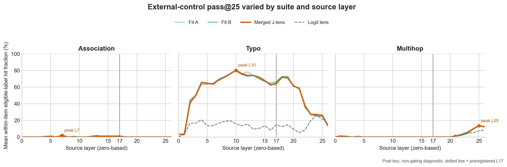

# R1 J-lens Phase-1 post-hoc failure map

**Status:** exploratory post-hoc diagnostic; non-gating.  
**Source run:** `jspace-p1-20260810T224338Z-996077031021`; independently validated under `jspace-p1v-20260810T231952Z-6ad3de6f3754`.  
**Registered outcome remains:** the fitted lens did not pass the prespecified validity gate. Phase 2 remains prospective/unrun.

## Result

The lens was numerically valid and split-half stable, but descriptive external-control pass@25 varied by suite and source layer. The registered inferential endpoints remain the all-layer union and L17; the external gate required two of three suites, and only typo qualified.

| Suite | Merged any-layer union (items with >=1 hit) | Merged L17 (items with >=1 hit) | Post-hoc descriptive peak (merged) | Registered disposition |
|---|---:|---:|---:|---|
| Association | 0.0408 (4/98) | 0.0102 (1/98) | L7: 0.0204 | non-qualifying |
| Typo | 0.8958 (86/96) | 0.6458 (62/96) | L10: 0.8021 | qualifying |
| Multihop | 0.1852 (15/81) | 0.0000 (0/81) | L25: 0.1358 | non-qualifying |

The scores are means over items of the within-item fraction of eligible labels found in the relevant top-25 set; the parenthetic counts are the distinct number of items with at least one hit. “Any-layer union” is the registered item-level union over all 27 source layers, not an average of layer scores. Multihop passed the registered all-layer permutation criterion but failed the L17 criterion. Descriptively, association is sparse across the layer profile, while typo is strong through the middle layers and remains substantial at L17.

## Interpretation boundary

This diagnostic characterizes why the sealed gate did not pass. It does not replace the registered endpoint, select a new layer, change K, alter target eligibility, rescue the lens, or license J-space decomposition or causal intervention. Moving a future study from L17 to L24–26 would be a new hypothesis requiring a new preregistration and fresh confirmatory controls.

## Files

- `failure_map.json`: hash-bound structured summary and source identities.
- `layerwise_pass25.csv`: per-suite, per-lens layer profiles and cumulative unions.
- `target_rank_censored.csv`: eligible-label ranks, where 26 means “not in top 25.”
- `jspace_phase1_layerwise_pass25.png`: aligned three-panel visualization.
- `DIAGNOSTIC_MANIFEST.json`: output and source hashes.
