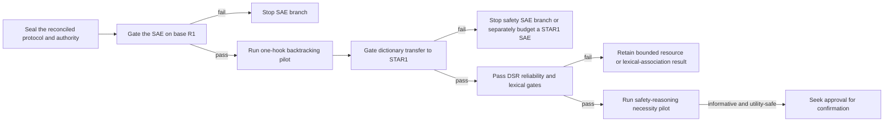

# SAE reasoning and safety-reasoning steering plan

**Date:** 2026-08-18
**Last reconciled:** 2026-08-18, after the Venhoff-style bridge audit
**Status:** PLANNED — NOT EXECUTED
**Record type:** operational planning document and literature synthesis. It is
not a preregistration, empirical result, thesis-scope amendment, or authority
to spend.
**Execution state:** Venhoff-style bridge reconciled; no SAE intervention has
been executed. The next permitted work is protocol sealing and the base-SAE
fidelity gate, subject to the applicable spending/scope authorization.
**Repositories:** `reasoning-on-manifold/` is the analysis repository;
`reasoning-on-manifold/thesis/` is a separate nested thesis repository.

Sealed preregistrations, machine-readable artefacts, provenance records, the
thesis revision charter, and the claim–artefact ledger control whenever they
conflict with this document. All numerical claims must be rechecked against
their artefacts before use. No experiment in this plan has been run merely
because it is described here.

## 1. Executive decision

The most useful next study is a **small, gated comparison of dense
residual-stream steering and SAE-coordinate steering at the same hook point**.
It should begin with backtracking, the strongest existing local steering case,
and expand to safety reasoning only if the public SAE passes a
checkpoint-transfer fidelity gate on a safety-trained reasoning model.

The proposed programme has two linked questions:

1. **Reasoning representation:** does an SAE dictionary capture the supervised
   residual contrast associated with a reasoning behaviour, and can a sparse
   subset of its features reproduce the behaviour change?
2. **Safety reasoning:** can the same framework identify and causally perturb
   *process-level* safety reasoning—harm recognition, policy/specification
   retrieval, and action commitment—without confusing it with refusal wording,
   harmful-topic recognition, or generic response-length changes?

The recommendation is therefore a **gated safety extension, not an immediate
replacement of the generic study**. Backtracking provides the lower-risk
methodological anchor; safety reasoning becomes the second leg only after the
same-site SAE comparison and the STAR1 transfer gate are interpretable.

The completed Venhoff-style run changes the operator decision but not the core
research question. It reproduced the released metric arithmetic, yet the new
behavioural run used thesis tasks, hybrid thesis directions, a different
annotation route, and a large constant residual write. It is therefore a
**provisional operator-sensitivity bridge, not a successful Venhoff
replication**. Its complete cases show very large apparent suppression for
backtracking, uncertainty, and example testing, but 60/250 records are
unresolved, every primary cell is confirmatory-ineligible, and repetition and
token-cap damage are substantial. It does not justify carrying the published
constant-write dose into the SAE comparison or choosing a smaller additive
dose after seeing these outcomes.

The lean pilot now uses one checkpoint family, one exact layer/hook, the
thesis's projective-ablation operator at \(\alpha=1\), and five generation
arms:

1. unsteered;
2. dense residual contrast;
3. full decoded SAE latent contrast;
4. one energy/displacement-matched random residual direction; and
5. one chain-level label-shuffled direction passed through the same primary
   construction pipeline.

The sparse top-\(k\) mixture is deferred until the full decoded-SAE arm passes
fidelity, causal-effect, and utility gates. It can then be added without
regenerating a hash-compatible baseline. Sweeps over SAE feature count,
individual features, layers, operators, doses, and random seeds are deliberately
excluded from the initial generation study. Cheap reconstruction, lexical, and
feature-stability checks remain **analytic gates**, not additional generation
arms.

This design is intentionally sequential. Failure at any fidelity, provenance,
lexical-specificity, or utility gate stops the downstream claim rather than
opening a larger search.

## 2. What this plan does—and does not—change

### 2.1 Current thesis evidence remains unchanged

The current safety chapter studies **generic-reasoning activations under safety
versus matched non-safety post-training**. It is teacher-forced and does not
measure free-generation refusal, benign compliance, correctness, or
process-level safety reasoning. Its four generic behaviours are explicitly not
safety concepts. The bounded current interpretation remains that translation
is clearer than strong reshaping under the tested fixed-input conditions, while
recipe-associated directionality is exploratory. See the
[current safety chapter](thesis/chapters/v2/safety.tex).

The proposed SAE and safety-steering work is therefore **prospective/unrun**.
It may later bridge the current representation-change analysis to a behavioural
safety study, but it does not retroactively turn the existing safety chapter
into one.

### 2.2 Evidence-status ledger for this plan

| Item | Current status | Permitted use |
|---|---|---|
| Existing thesis steering findings | Existing bounded/amended evidence; backtracking is the strongest local case | Motivation and baseline only; preserve its local estimands and caveats |
| Existing safety post-training chapter | Bounded fixed-input evidence | Motivation for a post-training/SAE decomposition; not a safety-behaviour result |
| Public base-model SAE gate | Current resource record outside the frozen thesis evidence snapshot | Feasibility evidence only; not behavioural evidence |
| Completed Venhoff-style bridge | Provisional complete-case operator-sensitivity result with unresolved provenance; not a direct replication | Operator/damage calibration only; no thesis-status upgrade |
| Existing deliberative-safety-reasoning H1 pilot | Provisional, with unresolved provenance and small positive-chain count | Taxonomy/design input only; not evidence for the 1.5B experiment |
| Existing P5 safety generations | Pipeline pilot/resource record; no valid arm-labelled safety result | Runtime and failure-mode calibration only |
| All new SAE reasoning and safety interventions | Prospective/unrun | No result language until executed, provenance-bound, and admitted |

New spending, Route-B work, or a thesis-scope expansion requires the applicable
author/supervisor authorization under the
[revision charter](thesis/_planning/THESIS_REVISION_CHARTER_2026-07-26.md).
If later admitted to the dissertation, integration must be page-neutral or name
a compensating cut, rebuild `thesis/ucl_msc.tex`, and report the actual page
count. The repository records currently disagree on whether the live count is
63 or 65 pages; that discrepancy must be resolved rather than guessed.

## 3. SAE conceptual model and its relationship to steering

### 3.1 A hook-specific dictionary, not necessarily one SAE per layer

An SAE is trained on activations from a particular **hook point and activation
distribution**. That point may be a residual-stream boundary, an MLP output, an
attention output, or another named site. “One residual SAE for each transformer
block” is a possible release design, not the definition of an SAE. A 28-block
model may have fewer SAEs, 28 SAEs, 29 residual-boundary SAEs, or several SAEs
per block. Public programmes illustrate both extremes: Anthropic’s cited study
used a middle-layer residual site, while
[Gemma Scope](https://deepmind.google/blog/gemma-scope-helping-the-safety-community-shed-light-on-the-inner-workings-of-language-models/)
released SAEs across layers and sublayer outputs.

For an activation \(h\in\mathbb{R}^d\) at one fixed hook, write

\[
z=E(h)\in\mathbb{R}^{F},\qquad
\hat h=b_D+D z.
\]

The encoder produces a sparse latent vector \(z\), usually in an overcomplete
space \(F>d\). The decoder columns \(d_j=D_{:,j}\) reconstruct directions in
the original activation space. Training balances reconstruction against a
sparsity constraint, using objectives such as L1, TopK, or JumpReLU variants.
Reconstruction is approximate, so \(\hat h\neq h\) in general.

An SAE latent is a neuron of the **auxiliary autoencoder**, not normally a
single neuron of the language model. Its encoder weights act as a detector;
its decoder column is the direction written back into the model activation.
A human label such as “backtracking” or “harm recognition” is an empirical
interpretation based on activating examples, held-out specificity tests, and
ideally causal intervention—not an intrinsic semantic guarantee.

Because an SAE dictionary is overcomplete and decoder columns need not be
orthogonal, nearby or correlated latents can split, duplicate, or obscure a
concept. Directly steering one decoder column can also move many other latent
coordinates after the model resumes computation. “One latent = one isolated
concept knob” is therefore a hypothesis to test, not an assumption.

### 3.2 Dense and SAE-space contrasts

For positive and negative contrast sets at the same hook, the ordinary dense
contrastive direction is

\[
\Delta h=\mathbb{E}[h\mid +]-\mathbb{E}[h\mid -].
\]

The corresponding SAE-latent contrast must be built by encoding each actual
activation first:

\[
\Delta z=\mathbb{E}[E(h)\mid +]-\mathbb{E}[E(h)\mid -],
\qquad
v_{\mathrm{SAE}}=D\Delta z=\sum_j \Delta z_j d_j.
\]

Because the encoder is biased, sparse, and nonlinear, neither \(E(\Delta h)\)
nor \(D^\top\Delta h\) is automatically the latent steering vector.

For span-pooled representations, the order matters:

\[
\bar z_i=\frac{1}{|T_i|}\sum_{t\in T_i}E(h_{it}),
\]

not \(E(\frac{1}{|T_i|}\sum_t h_{it})\). The existing pooled residual caches
therefore cannot be passed directly through the nonlinear SAE; the target hook
must be replayed tokenwise.

Define the reconstruction residual

\[
\epsilon(h)=h-[b_D+D E(h)].
\]

Then the exact bookkeeping identity is

\[
\Delta h=D\Delta z+\Delta\epsilon.
\]

This decomposition is central to the study. It asks how much of the supervised
dense contrast lies in the learned SAE dictionary and how much remains in the
contrast of reconstruction errors. It does **not** by itself establish that the
SAE component is causal or semantically clean.

### 3.3 Single-feature and composed-feature interventions

A single SAE-feature intervention uses decoder column \(d_j\), for example by
adding \(\alpha d_j\) or clamping latent \(z_j\) while preserving the
unexplained residual. A composed SAE direction uses several decoder columns,
such as the full \(D\Delta z\) or a sparse top-\(k\) approximation.

The proposed primary comparison is **not** “the best hand-labelled feature
versus a dense direction.” The initial pilot compares the dense and full
decoded directions below; the sparse direction is a conditional second-stage
test:

| Representation | Construction | Question |
|---|---|---|
| Dense | \(\Delta h\) | What does ordinary contrastive steering recover? |
| Full decoded SAE | \(D\Delta z\) | How much causal effect is recoverable through the complete learned dictionary? |
| Sparse decoded SAE | \(D P_k\Delta z\) | Can a validation-selected small feature set retain the effect? |
| Reconstruction-error contrast | \(\Delta\epsilon\) | Offline diagnostic: what contrast is missed by the dictionary? |

All intervention directions are normalized under one locked convention, and
all are applied at the exact SAE hook. A dense direction previously trained at
L15 or L17 must be recomputed at the SAE site; comparing it with an SAE at L20
would otherwise conflate representation with layer.

### 3.4 Post-training bridge

If one SAE passes fidelity gates on both the base reasoning checkpoint and the
safety-post-trained checkpoint, byte-identical teacher-forced spans permit the
additional decomposition

\[
\delta h_{PT}=\mathbb{E}[h_{\mathrm{safety}}-h_{\mathrm{base}}]
=D\,\delta z_{PT}+\delta\epsilon_{PT}.
\]

This can test whether the existing fixed-input post-training displacement is
concentrated in SAE features associated with safety reasoning. It remains a
descriptive bridge unless paired with a causal generation intervention.

## 4. Literature review: reasoning behaviours and SAE features

This is a targeted review of the closest methodological work, not a systematic
review. Several items are recent preprints, so claims below should be checked
again at preregistration.

### 4.1 Dense reasoning steering

**Venhoff et al., “Understanding Reasoning in Thinking Language Models via
Steering Vectors”** ([paper](https://arxiv.org/abs/2506.18167),
[code](https://github.com/cvenhoff/steering-thinking-llms)) is the relevant
dense-residual steering baseline. It constructs behaviour directions from
labelled reasoning traces and intervenes in reasoning models. The parallel
session is attempting to reproduce this work. Its exact resolved contract—model
revision, labels, prompt formatting, activation site, vector normalization,
operator, token timing, dose, and evaluator—must be frozen before this SAE
extension runs.

The paper currently open in the browser, **Zhang et al., “Fantastic Reasoning
Behaviors and Where to Find Them”** ([RISE paper](https://arxiv.org/abs/2512.23988)),
is a different study. RISE trains bespoke SAEs on
DeepSeek-R1-Distill-Qwen-1.5B reasoning traces, maps decoder features to
reflection/backtracking labels, averages selected feature directions, and
projects along the resulting centroid during generation. It is the closest
published-in-spirit SAE precedent for this proposal, not “the Venhoff paper.”

As reported, RISE samples 500 MATH traces, segments chains at blank-line
reasoning-step delimiters, and trains small layer-specific ReLU SAEs on the
resulting residual activations. For the 1.5B model, its SAE latent width is
2,048 versus model width 1,536, with a reconstruction-plus-sparsity objective
reported as MSE plus \(\lambda L_0\) (\(\lambda=2\times10^{-3}\)), batch size
1,024, Adam learning rate \(10^{-4}\), warm-up, and cosine decay. GPT-5 labels
steps as reflection, backtracking, or other; behaviour-associated decoder
columns are then averaged into a centroid. The causal experiment applies a
projection-like operator at reasoning-step boundaries using several signed
coefficients. Thus, the SAE fitting is unsupervised, but the mapping from
features to named behaviours is semantically supervised.

RISE is valuable evidence that SAE features can be associated with reasoning
strategies and used interventionally, but important details and controls are
underreported: exact hook conventions, held-out feature selection, SAE
reconstruction and dead-feature diagnostics, full off-target behaviour effects,
same-site dense comparators, random and shuffled controls, lexical falsification,
length-normalized behaviour rates, broad correctness guards, and uncertainty
intervals. Its reported intervention sign also needs empirical verification
against the realized projection coordinate, and the apparent final-block/hook
indexing needs an implementation test rather than assuming “layer 28” has one
unambiguous meaning. The differentiable implementation of the stated \(L_0\)
penalty and full SAE quality metrics are also not specified sufficiently for an
exact rebuild. No official complete reproduction bundle was located in this
review, so the appropriate goal is a transparent reconstruction and extension
rather than an exact replication claim.

### 4.2 Closely related SAE-reasoning studies

| Work | Main idea | What it contributes | Limitation this plan addresses |
|---|---|---|---|
| Galichin et al., [“I Have Covered All the Bases Here: Interpreting Reasoning Features in Large Language Models via Sparse Autoencoders”](https://arxiv.org/abs/2503.18878) | Scores/manually interprets reasoning-related SAE features in an R1-distilled model and steers with decoder vectors | Direct precedent for SAE feature steering in a reasoning model | Individual-feature selection, lexical markers, response length, and correctness are difficult to disentangle |
| Fang et al., [“Controllable LLM Reasoning via Sparse Autoencoder-Based Steering”](https://arxiv.org/abs/2601.03595) | Screens features using lexical/logit evidence and causal intervention across several strategies | Broader behaviour taxonomy and intervention-based feature selection | A selected feature may capitalize on the same evaluation set; multiple controls and held-out selection remain important |
| Ma et al., [“Do Sparse Autoencoders Identify Reasoning Features in Language Models?”](https://arxiv.org/abs/2601.05679) | Applies token, paraphrase, and lexical-falsification tests to candidate reasoning features | Strong warning that apparently semantic reasoning features may instead track words or discourse templates | This plan makes lexical specificity a preregistered zero-generation kill gate |
| [Latent Reward Steering](https://arxiv.org/abs/2606.00726) | Learns adaptive low-dimensional latent rewards/controllers | Shows a route beyond a fixed mean-difference direction | Adaptive controllers are deferred until fixed-direction attribution is established |
| [Resa](https://arxiv.org/abs/2506.09967) | Uses sparse representations during reasoning-related training | Connects SAE-style representation to training-time control | It is adjacent rather than a clean inference-time dense-versus-SAE causal comparison |

### 4.3 Gap filled by the generic-reasoning experiment

The defensible contribution is:

> At one exact hook in an open, teacher-distilled reasoning model, decompose a
> held-out behaviour contrast into decoded-SAE and reconstruction-error terms,
> then compare dense, full-decoded, and one sparse decoded intervention under a
> common operator, energy convention, random direction, label shuffle,
> lexical-specificity gate, length normalization, and accuracy guard.

This would improve causal and representational comparability. It would **not**
be the first SAE reasoning-steering study, prove that SAE latents are model
neurons, or establish a universal reasoning circuit.

## 5. Literature review: safety features, refusal, and safety reasoning

### 5.1 Anthropic’s safety-related features

Anthropic’s [Scaling Monosemanticity](https://transformer-circuits.pub/2024/scaling-monosemanticity/index.html)
trains very wide SAEs at a middle-layer residual-stream site in Claude 3 Sonnet.
The work identifies interpretable features associated with unsafe code,
backdoors, bias, sycophancy, deception/power-seeking, secrecy, and dangerous
content, and presents qualitative feature-clamping/steering examples.

The key opportunity is real: an SAE offers a common dictionary in which to ask
whether safety post-training changes the frequency, strength, or causal role of
safety-associated features. The key caution is equally important: the presence
of an interpretable feature does not show that the model will perform the
associated dangerous behaviour, that the feature is unique or exhaustive, or
that it is a safe isolated control knob. Anthropic explicitly frames many of
these safety uses as promising rather than established. The case studies are
not a held-out taxonomy of safety *reasoning steps* and do not provide the
dense-versus-SAE comparison proposed here.

### 5.2 Refusal and safety-outcome steering

Dense refusal work such as Arditi et al., [“Refusal in Language Models Is
Mediated by a Single Direction”](https://arxiv.org/abs/2406.11717), shows that a
residual direction can strongly affect refusal. SAE studies then make this
control more feature-oriented:

- O’Brien et al., [“Steering Language Model Refusal with Sparse
  Autoencoders”](https://arxiv.org/abs/2411.11296),
  uses decoder features to increase refusal robustness, with capability and
  over-refusal costs at stronger interventions.
- Yeo et al., [“Understanding Refusal in Language Models with Sparse
  Autoencoders”](https://arxiv.org/abs/2505.23556), separates refusal-associated
  and harm-associated sparse features and tests causal clamping and OOD probes.
- Kissane et al., [dataset-dependence case study](https://www.alignmentforum.org/posts/rtp6n7Z23uJpEH7od/saes-are-highly-dataset-dependent-a-case-study-on-the),
  reports that refusal can appear diffuse in an SAE trained on generic
  pretraining text and more concentrated when the SAE training distribution
  contains chat data. This makes the public SAE’s training distribution a
  substantive validity issue, not metadata trivia.
- [“Sparse Autoencoders are Capable LLM Jailbreak Mitigators”
  (CC-Delta)](https://arxiv.org/abs/2602.12418) uses paired harmful prompts with
  and without jailbreak wrappers to select sparse feature sets and steer
  safety–utility behaviour across attacks.
- [Beyond “I’m Sorry”](https://arxiv.org/abs/2509.09708) studies feature subsets
  whose ablation flips refusal, including redundant or compensating features.
- [Graph-Regularized SAEs](https://arxiv.org/abs/2512.06655) treats safety
  behaviour as potentially distributed rather than forcing a single isolated
  feature.

These studies are closest on *safety outcomes*. They mainly contrast harmful
content, attacks, or refusal/compliance, rather than labelled internal
deliberation such as recognizing harm, recalling a policy, weighing it, and
committing to an action. That distinction is the central niche for this plan.

### 5.3 Process-level safety reasoning

Anthropic’s [biology attribution-graph case studies](https://transformer-circuits.pub/2025/attribution-graphs/biology.html)
trace paths from hazardous concepts through danger/harmful-request
representations to refusal. They demonstrate why a process-level causal account
may require multiple features and layers, while also exposing unexplained
“dark matter.” They are detailed case studies rather than a controlled SAE
steering benchmark.

[HarmThoughts](https://arxiv.org/abs/2604.19001) introduces a large
sentence-level taxonomy of harmful reasoning traces. It is useful external evidence that
safety-relevant process labels can be annotated, but beginning with its full
taxonomy would create excessive multiplicity for this pilot.

[Chain of Risk](https://arxiv.org/abs/2605.05678) evaluates both reasoning traces
and final-answer safety and develops dense adaptive, principle-based steering.
It motivates evaluating process and endpoint together, but does not answer
whether public SAE features capture the same process directions.

[“Beyond a Single Direction: Chain-of-Thought Disrupts Simple Steering of
Refusal”](https://arxiv.org/abs/2605.26772) argues that regenerated reasoning can
reinforce or recover refusal after a simple intervention. This makes one-shot
endpoint measurement insufficient: the experiment must observe the reasoning
trajectory, intervention timing, and recovery as well as the final answer.

For evaluation rather than feature discovery,
[XSTest](https://arxiv.org/abs/2308.01263) is especially relevant to benign
over-refusal, while [HarmBench](https://arxiv.org/abs/2402.04249) and
[JailbreakBench](https://arxiv.org/abs/2404.01318) provide broader standardized
attack/evaluation frameworks. Any reused items still require a
checkpoint-training-overlap audit, and the pilot’s paired harmful/benign-lookalike design
should remain primary.

### 5.4 Gap filled by the safety experiment

The defensible safety contribution is:

> In an open safety-post-trained, teacher-distilled reasoning model, compare a
> same-layer dense direction with full and sparse decoded-SAE directions for
> reliably labelled safety-reasoning steps, while separately measuring the
> reasoning process, harmful-request outcome, benign-lookalike compliance,
> generic utility, and generation damage; relate these directions to the
> fixed-input safety-post-training displacement when SAE transfer is valid.

This is narrower than “finding the model’s safety circuit” but more specific
than steering refusal. It separates:

- **safety-reasoning process:** harm recognition, policy retrieval, and action
  commitment inside the chain;
- **safety outcome:** refuse, safely complete, or unsafely comply; and
- **surface form/topic:** harmful vocabulary, refusal phrases, policy words,
  and generic discourse markers.

The study must not claim to be the first safety SAE steering, the first
reasoning-model safety steering, or proof of a complete safety mechanism.

## 6. Model, SAE, and data resources

### 6.1 Base reasoning model

[DeepSeek-R1-Distill-Qwen-1.5B](https://huggingface.co/deepseek-ai/DeepSeek-R1-Distill-Qwen-1.5B)
is the preferred base because it is
already used by the thesis, is small enough for inexpensive activation replay
and generation, has 28 transformer blocks with residual width 1,536, was
distilled from a reasoning teacher, and has public SAEs.

### 6.2 Candidate SAEs

**Primary operational candidate:**
`DGurgurov/DeepSeek-R1-Distill-Qwen-1.5B-sae` was empirically resolved locally
to raw `blocks.19.resid_post`, with 24,576 ReLU latents. The existing
[resource gate](results/sae_gate/R1-1.5B/REPORT.md) reports FVU 0.0608, mean L0
70.9, and cross-entropy recovery 0.958 on 60 thesis chains truncated to the
first 1,024 tokens. The run took about 16 minutes on local MPS. Metadata across
the card, folder, and configuration was contradictory, and the resource has
not been checked on late chain-of-thought positions or a safety checkpoint.
It remains a resource record outside the frozen thesis evidence snapshot.

**Independent replication candidate:**
[analist/sae-r1-distill-qwen-1.5b-resid-l20-reasoning](https://huggingface.co/analist/sae-r1-distill-qwen-1.5b-resid-l20-reasoning)
is trained on the exact model family at residual-post L20, with 65,536 TopK
latents, \(k=32\), and an MIT licence. It was trained on reasoning-oriented
OpenThoughts data and reports held-out FVU. However, its model revision is not
pinned in the visible configuration and its final training log reports many
dead features. It is useful as a later resource-replication check, not the
cheapest first pilot.

EleutherAI’s exact-model releases cover all 28 layers but hook MLP outputs
rather than the residual stream. They can support a later sublayer study, but
they cannot encode the thesis’s saved residual activations or serve as the
primary same-site residual comparison.

### 6.3 Safety-post-trained model and dictionary-transfer risk

[STAR1-R1-Distill-1.5B](https://huggingface.co/UCSC-VLAA/STAR1-R1-Distill-1.5B)
is the preferred safety checkpoint: it is a
safety-supervised fine-tune of the same small reasoning-distilled architecture.
The candidate public SAEs were trained on the **base** checkpoint. Architectural
compatibility does not establish dictionary compatibility after safety
post-training.

The base SAE may be used on STAR1 only after a blind, identical-hook comparison
of reconstruction, functional loss, sparsity/liveness, token-position
stability, and target-span fidelity. If transfer fails, the safety SAE branch
stops or receives a separately authorized STAR1-specific SAE budget. There is
no fallback claim based on a failed-transfer dictionary.

### 6.4 Safety data restrictions

- `data/safety_star1_sft.json` contains STAR-1 training examples. It may support
  discovery and annotation-method development, but not held-out evaluation of
  STAR1 or a checkpoint trained on it.
- `data/grpo_refusal_prompts.json` is also inadmissible as held-out safety
  evaluation because all 250 harmful prompts overlap STAR-1 training.
- A frozen 24-prompt train-disjoint pilot with harmful/benign look-alikes and 20
  generic prompts is available for pipeline smoke testing. Its 176 existing
  generations are a resource record only; the scoring route failed and was
  replanned.
- The existing pilot produced 370,163 tokens in 7.34 aggregate local-MPS hours,
  and many outputs hit a length-like cap. Length, truncation, repetition, and
  termination are therefore mandatory damage endpoints.

## 7. Safety-reasoning construct and annotation

### 7.1 Primary construct

Use the three locally reliable deliberative-safety-reasoning labels:

1. **harm recognition:** the chain identifies a concrete harm or unsafe aspect;
2. **specification citation:** it retrieves or invokes a relevant policy,
   specification, or safety rule; and
3. **decision:** it commits to an action—refuse, safely complete, or comply.

The primary low-multiplicity endpoint is their union, **DSR-present**. Component
labels are secondary/descriptive during the pilot. The earlier `adjudication`
label is excluded because post-revision Fleiss \(\kappa=0.226\); it must not be
reinstated without a new reliability study. Existing agreement estimates for
the retained labels were 0.8389 (harm recognition), 0.8854 (specification
citation), and 0.798 (decision), but these are design resources from a different
20B-model corpus, not validation on STAR1.

Before direction construction, a checkpoint-specific annotation gate should
double-code a frozen sample, use chain-level splits, publish disagreements and
class counts, and verify that positive spans occur across topics and positions.

### 7.2 Contrast definition

The primary positive set is DSR-present spans. Negatives should be
within-chain or at least within-topic matched, unlabeled reasoning spans with a
similar token-position and length distribution. This reduces trivial separation
by prompt topic, chain phase, and verbosity.

Separately construct a refusal/compliance outcome direction only as a
comparator. Never rename a harmful-versus-benign or refusal-versus-compliance
direction “safety reasoning.”

### 7.3 Zero-generation lexical kill gate

Reducing generation arms does not justify removing construct-validity tests.
Before intervention, run a cheap text-only baseline and marker-held-out tests:

- bag-of-words or similarly transparent text classifier;
- topic-held-out and prompt-family-held-out evaluation;
- removal/holdout of explicit markers such as “harmful,” “policy,” “refuse,”
  “wait,” and “alternatively”; and
- activation-feature stability under paraphrases that preserve the intended
  safety decision.

The local forged-versus-genuine safety probe previously gave both text and
activation classifiers AUROC 1.00, correctly preventing a provenance claim.
If the lexical gate fires here, the selected dimensions must be called
**lexical/discourse-associated features**, not safety-reasoning features. This
is an analytic stop rule, not another intervention arm.

## 8. Experimental programme

### Stage 0 — coordination and protocol lock

The Venhoff dependency is now resolved. The completed run exactly replayed the
released metric arithmetic on the public records, but the new generation study
was a thesis-task/hybrid-direction bridge rather than a direct replication. In
complete cases it reduced the annotated target fraction by about 98.2% for
backtracking, 96.9% for uncertainty, and 96.9% for example testing; adding
knowledge was non-confirmatory. These values remain provisional: only 190/250
records resolved, all primary cells are confirmatory-ineligible, the run is
dirty/untracked, and source-direction provenance is unresolved.
The controlling records are the
[bridge report](results/eval/R1-1.5B__venhoff_constant_all4_hybrid_user_publishednorm/venhoff_bridge_report.json),
[annotation status](results/eval/R1-1.5B__venhoff_constant_all4_hybrid_user_publishednorm/annotation_status.json),
[generation diagnostics](results/eval/R1-1.5B__venhoff_constant_all4_hybrid_user_publishednorm/generation_metrics.json),
and [provenance](results/eval/R1-1.5B__venhoff_constant_all4_hybrid_user_publishednorm/provenance.json).

The large constant write was also damaging. Baseline repetition was 0.186,
rising to 0.272, 0.466, 0.525, and 0.760 across the four steering arms; many
outputs hit the 1,000-token cap, and the run had neither a correctness guard nor
matched random/shuffled controls. The bridge therefore informs operator risk
but does not establish direction-specific, useful control.

The locked primary family for Stage 2 is consequently the thesis's projective
ablation,

\[
h'=h-(v^\top h)v,
\]

with unit-normalized directions and \(\alpha=1\), applied at every hooked
position including prefill. This choice is anchored to the existing bounded
backtracking result rather than selected from the new bridge outcomes. Do not
tune a lower constant-addition dose on the observed 50-task results.

Before execution:

1. preserve the bridge as a provisional operator-sensitivity resource and seal
   a bounded STOP/CONTINUE memo;
2. reuse outputs only when every checkpoint, prompt, decoding, evaluator, hook,
   and operator hash matches exactly;
3. pin the projective sign/timing/normalization implementation with a realized
   coordinate test; and
4. seal a new preregistration and input manifest before behaviour-labelled
   intervention output is inspected.

At most one schema-preserving annotation retry may recover genuinely retryable
bridge rows, with deterministic alignment failures repaired separately. Do not
generate more bridge outputs, relax coverage, impute unresolved rows as zero,
or chase all four behaviours. The new study is an **SAE-basis extension of the
thesis**, not a Venhoff replication.

### Stage 1 — resource and fidelity gates

At the empirically resolved raw `blocks.19.resid_post` hook for the initial
DGurgurov resource:

1. pin model, tokenizer, SAE revision, hook name, tensor convention, dtype, and
   checksums;
2. replay tokenwise activations at early, middle, and late chain positions and
   in each target-behaviour window;
3. measure FVU/reconstruction error, cross-entropy or KL recovery under SAE
   substitution, sparsity, dead/live features, activation norm, and
   token-position drift;
4. repeat the identical gate on STAR1 and held-out safety windows; and
5. store per-chain rather than only pooled summaries.

The prior local thresholds FVU \(\leq0.15\) and cross-entropy recovery
\(\geq0.85\) can be declared as pilot gates if retained unchanged before
execution; they are not universal guarantees. A resource that passes only the
first 1,024 tokens has not passed for 5,000–8,000-token reasoning traces.

**Stop rules:**

- Base-model fidelity failure stops all SAE intervention with that dictionary.
- Material late-CoT or target-window degradation narrows the valid scope or
  stops the behaviour study.
- STAR1 transfer failure stops safety SAE steering; the generic base-model
  study may continue.

### Stage 2 — generic backtracking pilot

Backtracking is the only initial generic behaviour because it has the strongest
existing local evidence. Do not begin by multiplying four behaviours by all SAE
representations.

**Direction construction**

- Replay the same onset-window rule tokenwise at the exact SAE hook.
- Use positive backtracking spans versus the frozen complement definition.
- Split by chain into construction, validation, and held-out evaluation sets.
- Compute \(\Delta h\), \(D\Delta z\), and offline \(\Delta\epsilon\).
- Do not select \(k\) or construct a sparse intervention until the full decoded
  direction passes the initial fidelity, causal-effect, and utility gates.

**Generation arms**

| Arm | Direction | Purpose |
|---|---|---|
| G0 | none | Unsteered baseline |
| G1 | \(\Delta h\) | Same-site dense comparator |
| G2 | \(D\Delta z\) | Full SAE-coordinate recovery |
| G3 | energy/displacement-matched random residual direction | Non-specific perturbation control |
| G4 | chain-label-shuffled \(D\Delta z^{\pi}\) | Supervision/label-association control through the primary SAE pipeline |

Use greedy decoding, a maximum of 8,192 new tokens, the pinned thesis prompt and
model revision, and the same projective operator at every position including
prefill. Use one frozen random seed and one frozen shuffle for the pilot. Match
G3 to G1 and G4 to G2 using mean squared realized displacement on a frozen
unsteered calibration set. This supports a local feasibility comparison, not a
claim about a population of controls. A confirmatory phase requires multiple
predeclared control seeds.

**Primary endpoints**

- target-behaviour count per chain;
- target-behaviour count per 1,000 generated tokens; and
- final-answer correctness.

**Mandatory damage endpoints**

- output-token count and completion rate;
- truncation/cap hit;
- repetition/degeneration;
- off-target reasoning-behaviour counts; and
- format/evaluator failures.

Use the chain as the independent unit. Report paired effects and uncertainty,
not sentence rows as independent observations. A 50-task pilot is sufficient
for feasibility and variance calibration, not a narrow accuracy claim; a later
confirmatory accuracy study should use at least the preregistered powered count.

### Stage 3 — safety representation and post-training bridge

This stage runs only after STAR1 dictionary transfer and the annotation/lexical
gates pass.

1. Develop the three-label DSR annotation protocol on training/discovery
   material, then freeze it before held-out evaluation.
2. Obtain train-disjoint safety-reasoning traces with harmful prompts and
   benign look-alikes across several domains.
3. Build the primary DSR-present dense and SAE contrasts at the exact same hook
   with chain-level splits.
4. Replay byte-identical spans through base R1 and STAR1.
5. Decompose \(\delta h_{PT}=D\delta z_{PT}+\delta\epsilon_{PT}\).
6. Report cosine/alignment and feature-overlap estimates with shuffle
   uncertainty, while keeping them distinct from causal intervention results.

This stage tests whether safety post-training displacement and naturally
occurring safety-reasoning contrasts use overlapping SAE coordinates. It does
not yet show that those coordinates cause safety.

### Stage 4 — safety causal pilot

The first safety causal question should be a **necessity test in STAR1**:
attenuate the DSR-present coordinate using the operator locked at Stage 0
(projective ablation at \(\alpha=1\)). Positive addition
into the base model is a later sufficiency study, not another sign/operator arm
in the pilot.

Use a train-disjoint pilot of approximately 50 harmful prompts paired with 50
benign look-alikes, balanced over domains, plus a small generic-capability set.
Apply the same compact arm family as Stage 2. If the sparse arm was uninformative
or, as planned, omitted in Stage 2, do not restore it merely for safety.

**Process endpoints**

- DSR-present count and count per 1,000 tokens;
- retained component-label counts as secondary/descriptive;
- position/time to first decision; and
- recovery of DSR-present reasoning after intervention.

**Safety-outcome endpoints**

- harmful-request refusal;
- safe completion or safe redirection;
- unsafe compliance;
- benign-lookalike compliance and over-refusal; and
- final-answer correctness where a determinate answer exists.

**Damage/utility endpoints**

- length, truncation, repetition, and termination;
- generic reasoning accuracy;
- coherent instruction following; and
- evaluator abstention/disagreement.

Use paired prompt-level or chain-level inference, bootstrap confidence intervals
or paired randomization tests, and a small prespecified outcome family with an
appropriate multiplicity correction. Do not optimize dose or feature count on
the held-out outcomes. Potentially harmful generations should be stored in the
controlled result path and summarized without reproducing operationally harmful
content in the thesis.

### Stage 5 — conditional confirmation

Only if the earlier stages are informative and pass all guards:

- expand to at least 200 harmful/benign pairs or a power-analysis result;
- use three or more frozen random and shuffled controls;
- test the retained DSR components separately;
- test additive induction as a distinct sufficiency question;
- add an external taxonomy or benchmark family;
- consider the other generic reasoning behaviours; and
- consider a second SAE/checkpoint as replication.

This is a separate 1–2-week branch with separate authorization. A bounded
negative or resource result at the pilot stage is a legitimate stopping point.

## 9. Operator, matching, and reduced-control policy

### 9.1 Lock one intervention family

The current workstreams contain at least two operator families: constant vector
addition/subtraction and coordinate projection/ablation. RISE also applies its
operator at reasoning-step boundaries, whereas local work may intervene at
every generated token. These choices change the estimand.

The initial pilot locks projective ablation at \(\alpha=1\), unit-normalized
directions, and every-position intervention including prefill. Every dense,
SAE, random, and shuffled arm uses that same contract. Do not run a layer ×
operator × timing × dose grid. Any later constant-write Venhoff-family study is
a separately registered secondary experiment whose single dose must be chosen
on an annotation-blind calibration set using only completion, repetition, and
realized-displacement guards.

### 9.2 Energy/displacement matching

“Matched random” must be operational, not rhetorical. Match the realized
intervention magnitude under the chosen operator—for example, expected
per-token \(\|h'-h\|_2^2\) on a frozen calibration set—rather than only giving
unit-norm directions equal coefficients. Publish both nominal and realized
perturbation energy.

### 9.3 What the reduced controls can support

Random and label-shuffled directions are the right two generation controls for
a fast pilot:

- the random direction asks whether an equally energetic perturbation is
  sufficient; and
- the label shuffle asks whether the supervised association matters.

They do **not** by themselves distinguish safety reasoning from topic,
refusal-language, policy-word, token-position, or length effects. That is why
the matched harmful/benign design and zero-generation lexical gate remain
mandatory. With one random and one shuffle seed, conclusions must remain local
and feasibility-level.

## 10. Decision table and permitted interpretations

| Observation | Permitted interpretation | Not permitted |
|---|---|---|
| \(D\Delta z\) aligns with \(\Delta h\), exceeds shuffled alignment, and reproduces its causal effect | The tested public SAE dictionary captures a causal component of this local contrast | The SAE found the unique behaviour neuron |
| Sparse mixture retains the effect with similar or lower utility damage | The effect is concentrated in the selected dictionary subset under this selection rule | The concept is intrinsically represented by exactly those features |
| \(\Delta\epsilon\) is large or decoded steering misses the dense effect | The dictionary omits or distorts behaviour-relevant information at this hook/distribution | SAEs generally cannot represent reasoning |
| DSR changes without safety-outcome change | The intervention modulates annotated reasoning process under the tested evaluator | Safety improved or worsened |
| Safety outcome changes without DSR change | The intervention affects refusal/compliance or another pathway | It manipulates safety reasoning |
| Harmful refusal rises but benign compliance falls | Safety–utility/over-refusal tradeoff | Unqualified safety improvement |
| Lexical gate fails | Lexical/discourse-associated feature or contrast | Safety-reasoning feature |
| Random/shuffle effects overlap the target direction | Current non-confirmatory local result | Refutation of all steering or all SAE features |
| SAE fails on STAR1 | No valid safety-SAE conclusion with that resource | Evidence that STAR1 lacks safety features |

### 10.1 Planning priors, not promised results

The most plausible outcome is **partial**, not one-feature, recovery: the full
decoded direction should align with some fraction of the same-site dense
contrast, while a non-trivial reconstruction-error contrast and multiple active
latents remain. The dense projective arm may reproduce a bounded reduction in
backtracking; the decoded-SAE arm may be weaker if the public dictionary misses
late-CoT or behaviour-relevant variance. A useful result requires both arms to
outperform their matched controls without a comparable correctness,
termination, or repetition cost.

Four outcomes are equally publishable at pilot scale:

1. **Decoded recovery with specific causal effect:** supports the local claim
   that the SAE dictionary captures a causally usable component of the
   backtracking contrast.
2. **Geometric recovery without causal recovery:** shows that reconstruction or
   cosine alignment is insufficient evidence of a steering mechanism.
3. **Dense effect but weak decoded recovery or large \(\Delta\epsilon\):** bounds
   the public SAE's adequacy for this behaviour/distribution; it does not
   generalize to all SAEs.
4. **Target, random, and shuffled arms overlap or all damage utility:** leaves
   the pilot non-confirmatory and argues against a sparse-mechanism claim.

STAR1 dictionary transfer is especially uncertain. Even if it passes, the
first safety study is expected to distinguish process effects from refusal or
benign-compliance effects rather than yield an unqualified “safety
improvement.”

## 11. Cost estimate

These are planning ranges, not quotes or spending authority. They assume one
1.5B checkpoint resident at a time, one target hook, cached tokenwise
activations where safe, 3,000–5,000 generated tokens per long reasoning sample,
and commodity 24–48 GB inference hardware. Cloud prices change; obtain a fresh
quote from a provider such as [Runpod](https://www.runpod.io/pricing) before
authorization. Allow roughly twofold variance for long-tail generation length,
reruns, and evaluator failures.

### 11.1 Compute costs

| Work package | Scale assumption | Hardware time | Compute cash |
|---|---|---:|---:|
| Limited Venhoff cleanup | Existing outputs only; no new generation | Negligible | approximately $0 |
| Extended base-SAE gate | One hook; early/mid/late and backtracking windows | about 1–4 GPU-hours; under one active day | **$1–$6** |
| Five-arm generic pilot | 5 arms × 50 tasks = 250 long generations | about 3–8 GPU-hours at 3k tokens; higher near the 8,192-token cap | **$3–$10** |
| STAR1 transfer gate, conditional | Same hook and stratified safety windows | about 1–4 GPU-hours | **$1–$6** |
| Five-arm safety pilot, conditional | 5 arms × 100 paired-set prompts = 500 generations | about 5–14 GPU-hours at 3k tokens; higher for long traces | **$4–$14** |

The **next decision point only**—the extended base gate plus five-arm generic
pilot—therefore has an estimated compute cost of **$4–$16**. The conditional
STAR1 gate and safety pilot add approximately **$5–$20**. Local owned hardware
can reduce cash spend, but not elapsed time or electricity.

### 11.2 API and evaluator costs

| Work package | API use | API cash |
|---|---|---:|
| Optional Venhoff annotation cleanup | One schema-preserving retry of genuinely retryable rows only | **$0–$2** |
| Generic pilot scoring | Behaviour annotation and answer scoring for 250 outputs | **$5–$15** |
| Safety annotation/reliability, conditional | About 100 discovery chains, reliability checks, and failures | **$10–$35** expected; reserve **$30–$60** |
| Safety pilot judging, conditional | Process, safety outcome, benign compliance, and utility scoring | **$10–$40** |

The **next decision point only** has an estimated API cost of **$5–$17**,
including optional Venhoff cleanup. A later safety branch adds approximately
**$20–$75** in API/evaluator cost, depending mainly on annotation retries and
judge redundancy.

Thus the immediate base-SAE decision is approximately **$9–$33 total cash**:
**$4–$16 compute** plus **$5–$17 API**. The full base-plus-safety pilot is
roughly **$34–$128 total cash** before human labour. These are envelopes rather
than quotes; long-tail output length can move them by about twofold.

**Conditional confirmatory envelope:** roughly **$75–$300** across compute and
API costs, depending on sample size, trace length, control seeds, and evaluator
route.

**New-SAE contingency:** if the base SAE does not transfer to STAR1, do not hide
SAE training inside the pilot budget. A practical 24,576-latent, approximately
100M-token SAE may require on the order of 12–30 A100-hours, or roughly $17–$42
of training compute at the illustrative community A100 PCIe price of $1.39/hour
shown on 2026-08-18, but data generation, storage, tuning, evaluation, failures,
and replication dominate the true study cost. Reserve **$100–$250** for one
credible new-SAE attempt and **$250–$600** for a replicated attempt. These
estimates must be refreshed before spending.

Local-MPS calibration is slower but useful: the prior 60-chain × 1,024-token
gate took about 16 minutes, while the 176-output safety pipeline accumulated
about 7.34 serial hours for 370,163 tokens. Neither figure guarantees cloud-GPU
throughput.

## 12. Timeline and stop-gated schedule

The Venhoff dependency is reconciled. The clock begins only after the new
one-hook protocol and spending/scope authority are sealed.

| Phase after release of dependencies | Active time | Exit condition |
|---|---:|---|
| Seal Venhoff bridge and decision memo | 0.25–0.5 day | Provisional status, missingness, damage, and STOP decision recorded |
| Protocol, hashes, and preregistration freeze | 0.5 day | Exact hook/operator/data/evaluator contract sealed |
| Extended base-SAE gate | 0.5 day | Early/mid/late and backtracking-window pass |
| Tokenwise extraction and direction construction | 1 day | Dense/full/error decomposition reproducible |
| Generic backtracking pilot | 1–2 days | Generation, annotation, utility, and damage metrics complete |
| STAR1 transfer gate, conditional | 0.5 day | Safety branch dictionary transfer passes |
| Safety data and annotation preparation | 1–3 days | Train-disjoint prompt set and reliability/lexical gates pass |
| Safety causal pilot | 1–2 days | Paired process/outcome/utility endpoints complete |
| Analysis, audit, and write-up | 1–2 days | Provenance-bound report and decision memo complete |

The immediate base-only decision takes approximately **3–5 active working
days**. Including the conditional safety branch and final write-up gives about
**6–11 active working days**, or roughly **2–3 part-time calendar weeks**. A
broader confirmatory/component study adds about 1–2 active weeks and is not part
of the initial authorization.

## 13. Expected extensions over existing work

If executed as specified, the study would extend prior work in five
complementary ways:

1. **Same-site accounting:** dense and SAE directions are compared at one exact
   hook, with the exact residual identity
   \(\Delta h=D\Delta z+\Delta\epsilon\).
2. **Representation versus causality:** reconstruction/alignment, causal
   steering, and downstream utility are reported as separate estimands.
3. **Held-out semantic validity:** chain-level splits and lexical/paraphrase
   falsification reduce the risk that a “reasoning feature” is a token marker.
4. **Process versus safety outcome:** annotated safety reasoning is distinguished
   from refusal, harmful-topic recognition, benign over-refusal, and final
   correctness.
5. **Post-training bridge:** if dictionary transfer passes, safety-post-training
   displacement and causal DSR directions can be compared in one sparse
   coordinate system.

The study remains limited to one small checkpoint family, one hook, one SAE
training distribution, one primary reasoning behaviour, one primary safety
construct, and pilot-scale controls unless Stage 5 is separately run.

## 14. Artefacts required from each executed stage

Every stage should emit additive, hash-bound artefacts rather than overwrite a
prior report:

- exact model/tokenizer/SAE revisions and licences;
- input-manifest hashes and train-overlap audit;
- hook-resolution tests and tensor-shape convention;
- per-chain/token fidelity metrics, not only aggregate FVU;
- direction arrays with construction-set hashes;
- normalization and realized-energy diagnostics;
- generation contract, seeds, stop reasons, and raw result hashes;
- blinded annotations with reliability and evaluator version;
- paired item-level endpoints and exclusion reasons;
- statistical-analysis code/version and machine-readable tables;
- a claim/status ledger distinguishing prospective, pilot, exploratory,
  current non-confirmatory, and retained–bounded evidence; and
- a STOP/CONTINUE decision memo after every gate.

## 15. Immediate next-action checklist

1. Seal the Venhoff bridge as a provisional operator-sensitivity resource; add
   its damage/termination table and STOP/CONTINUE memo. Do no new generation or
   dose tuning.
2. Optionally make one unchanged-schema annotation retry within the existing
   cap, repair deterministic alignment failures, then freeze remaining rows as
   missing.
3. Pin the DGurgurov SAE at raw `blocks.19.resid_post`, record revisions and
   checksums, and extend its fidelity gate to early/mid/late and backtracking
   windows.
4. Seal a one-hook, backtracking-only, five-arm preregistration using projective
   \(\alpha=1\), greedy decoding, and an 8,192-token cap.
5. Replay activations tokenwise and construct same-site \(\Delta h\),
   \(D\Delta z\), shuffled \(D\Delta z^\pi\), random control, and offline
   \(\Delta\epsilon\).
6. Run the generic pilot and stop if SAE fidelity, causal specificity,
   correctness, termination, or degeneration guards fail.
7. Only after the base pilot is interpretable, gate SAE transfer to STAR1,
   freeze DSR annotation/data manifests, and consider the safety pilot.
8. Defer the sparse top-\(k\) mixture, other behaviours, additive sufficiency,
   and confirmatory control seeds to separately authorized stages.

Until protocol and spending authority are sealed, this remains a plan rather
than authority to execute.

## 16. Selected foundational references

- Cunningham et al., [“Sparse Autoencoders Find Highly Interpretable Features
  in Language Models”](https://arxiv.org/abs/2309.08600).
- Templeton et al., [“Scaling Monosemanticity: Extracting Interpretable Features
  from Claude 3 Sonnet”](https://transformer-circuits.pub/2024/scaling-monosemanticity/index.html).
- Gao et al., [“Scaling and Evaluating Sparse Autoencoders”](https://arxiv.org/abs/2406.04093).
- Rimsky et al., [“Steering Llama 2 via Contrastive Activation
  Addition”](https://aclanthology.org/2024.acl-long.828/).
- Chalnev et al., [“Improving Steering Vectors by Targeting Sparse Autoencoder
  Features”](https://arxiv.org/abs/2411.02193).
- Braun et al., [“Towards Principled Evaluations of Sparse Autoencoders for
  Interpretability and Control”](https://arxiv.org/abs/2405.08366).
