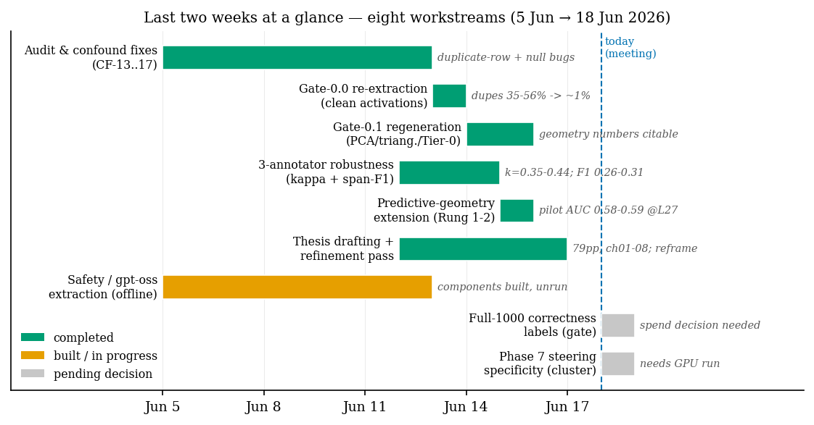
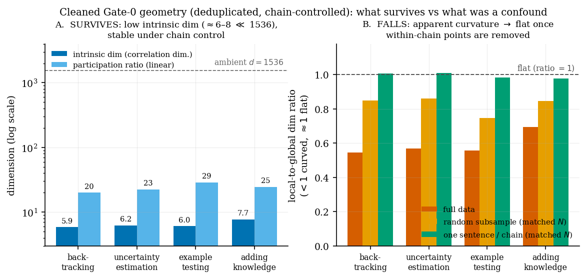
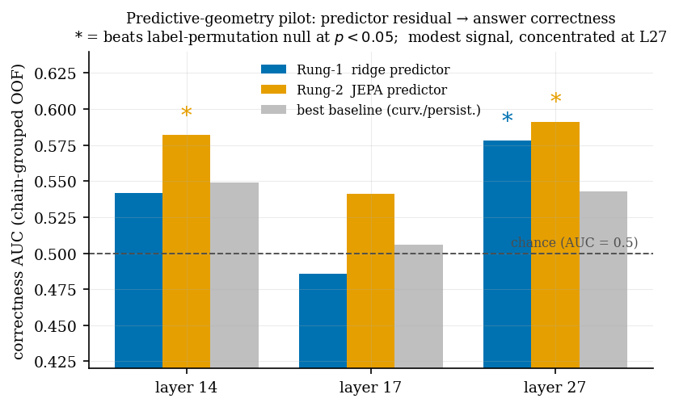

# Supervisor meeting — progress brief
**Date:** 18 June 2026 · **Period covered:** ~5 → 18 June 2026 (last 2 weeks, "last week" flagged) · **Project:** *The Geometry of Reasoning*

---

## TL;DR (read this first)

The last two weeks were a **"make the geometry trustworthy, then build on it"** fortnight. Three things happened:

1. **Scientific hardening + Gate-0 regeneration (the big one).** I found and fixed a family of confounds — chief among them a duplicate-row bug inflating every distance estimator (35–56% of pooled activations were exact duplicates) — re-extracted all activations clean, and **re-ran the whole geometry pipeline on clean data**. The headline result *changed honestly*: **low-dimensional per-behaviour structure survives every control, but per-behaviour "curvature" does not — it was a within-chain artefact.** Geometry numbers are now citable for the first time.
2. **A new extension — "Predictive Geometry of Reasoning"** (the JEPA × reasoning bridge). Built and pilot-tested in the last week: a next-step predictor over reasoning steps, using its *residual* as a correctness signal. **Modest but statistically significant** (AUC ≈ 0.58–0.59 at layer 27).
3. **Write-up moved a lot.** The thesis is now ~40k words across 11 chapters (8 drafted), compiles cleanly at **89 pages**, was reframed to match the cleaned geometry, had the Gate-0.1 numerals + four figures lifted into ch07, and went through a four-agent refinement + literature-scooping pass plus a conceptual expansion of ch02 (see the update note below).

**What I most need from you:** two spend/compute decisions (scale the correctness labels; run the causal steering experiment) and a framing sign-off on leading with the curvature *negative*. See **[Decisions needed](#decisions-i-need-from-you)**.

---

## Update — later on 18 June (continued work today)

Since this brief was first drafted, the geometry chapter went from embargoed placeholders to a **finished results chapter with real numbers and four figures**, and two results *hardened* the headline:

- **The numeral-lift is done.** Gate-0.1's full downstream completed on the cluster — chain-grouped probes (05c), layer triangulation, sub-type clustering (05d), and the per-layer 05b battery — and the now-citable numbers are written into **ch07** with four figures (the compression gap; curvature-as-chain-artefact; the layer profile; the silhouette). The thesis now compiles at **89 pages**.
- **The curvature negative is well-powered, not underpowered.** A detection-power analysis (closing NR-1, which had previously written an all-NaN table) shows the local-to-global diagnostic resolves curvature down to the smallest simulated level at $N \ge 500$; our chain-control pools (~600–900 independent chains) sit above that floor. **We had the power to detect curvature at the behaviour level and did not** — so the negative is a genuine null, not a missing-power result. (It also explains why the geodesic diagnostic, which needs $N \ge 2000$, couldn't isolate the chain effect while the local-global one could.) This directly strengthens decision #4 below.
- **Two more clean downstream findings.** Chain-grouped probe accuracy is **flat across all 28 layers** at 0.70–0.84 — and *below* the pre-fix leaky 0.83–0.93 (the grouped CV removed a train/test leak; the drop is the correction working). Sub-type clustering finds **no discrete sub-behaviours** (silhouette ≤ 0.18 at $k=2$): each behaviour is a continuous region. Honest nuance: the *geometry* (participation ratio) peaks mid-network while *decodability* (the probe) does not — they disagree, and I report both.
- **R2.2 is now running** (not just owed): the multi-annotator pipeline is regenerating the geometry under each annotator's labels on the cluster (Qwen3 done; Nova-Pro in progress), closing the annotator-robustness loop autonomously.
- **The conceptual chapter (ch02) was substantially expanded** after a close read: a transformer/residual-stream **notation** set + an architecture diagram (shown once); the **theory of manifold steering** (projecting the difference-of-means onto the PCA subspace, and why projection sustains the effect where a raw direction saturates); discussions of **atomic parts of reasoning** (composition as a steering-vector algebra) and **whether post-training is necessary** ("base models know how to reason, thinking models learn *when*"); and a new **"limits of algorithmic reasoning"** section that grounds the thesis's *measurement-not-proof* stance in undecidability (Rice's theorem) — which also frames AI safety as an undecidable semantic property, apt for the Holistic AI angle. Three geometric-intuition figures were added (PCA, flat-vs-curved manifold, manifold steering).
- **Title page finalised:** MSc in Computational Finance; a joint industry research project with Holistic AI; supervised by Dr Paolo Barucca (UCL Financial Computing) and Zekun Wu (Holistic AI).

---

## At a glance

| # | Workstream | Status | Headline outcome |
|---|---|---|---|
| 1 | Audit & confound remediation (CF-13…17) | ✅ Done | Duplicate-row + null-test bugs fixed; test suite green |
| 2 | Gate-0.0 re-extraction (clean activations) | ✅ Done | Duplicate fraction 35–56% → ~1%; verified clean |
| 3 | Gate-0.1 regen (PCA / 05c probes / triangulation / 05d / 05b / power) | ✅ Done | **Citable & lifted into ch07**: low-dim survives, curvature falls (well-powered), probes flat, no sub-types |
| 4 | 3-annotator robustness (κ + span-F1) | ✅ Done | κ = 0.35–0.44 (fair–moderate); span-F1 0.26–0.31 |
| 4b | R2.2 geometry replication under each annotator | 🟧 Running | Multi-annotator pipeline on cluster (Qwen3 done; Nova-Pro in progress) |
| 5 | Predictive-geometry extension (Rung 1–2) | ✅ Pilot done | Residual→correctness AUC 0.58–0.59 @ L27 (sig.) |
| 6 | Thesis: reframe + ch07 numeral-lift + ch02 expansion | ✅ Done | **89 pp**; ch07 numbers+figures in; ch02 conceptual expansion |
| 7 | Safety / gpt-oss extraction extension | 🟧 Built, unrun | Components offline-tested; needs GPU + a scope call |
| 8 | Full-1000 labels & Phase-7 steering | ⬜ Pending | **Need your decision** (spend / compute) |

---

# PART A — Experiments

## A1. Scientific hardening — why the old numbers were quarantined, and why the new ones aren't

Before this fortnight, **all geometry numbers were quarantined** pending a known list of confounds. I worked through them and fixed them in code (commits `47a168d`, `2d4ec11`, `542b321`, `5e37e46`):

- **CF-13 (the keystone bug):** 35–56% of pooled activation rows were **exact duplicates** — short repeated markers ("Wait", "So") matched to the same span. This corrupted every k-NN / intrinsic-dimension / curvature estimator *and* biased the permutation null **anti-conservatively** (duplicates concentrate within a label, so real matrices looked duplicate-rich vs permuted ones). Fixed with occurrence-aware span location + dedup.
- **CF-14:** a row-provenance bug made the within-chain permutation a no-op (p ≈ 1.0). Now there's a `row_index.json` sidecar written at extraction time with a hard-fail guard.
- **CF-15/16/17:** probe chain-leakage (→ grouped splits), un-smoothed permutation p-values (→ Phipson–Smyth + Holm–Bonferroni), and Phase-7 pre-spend debt.

**Takeaway for the meeting:** the reason the geometry story shifted is *not* fragility — it's that the pre-fix numbers were measuring a duplicate/autocorrelation artefact, and the clean numbers tell a sharper, more defensible story. This is the honest-by-design posture the whole thesis rests on.

## A2. Gate-0 regeneration — the cleaned geometry headline ⭐

Re-extracted all activations on the cluster (verified clean: duplicate fraction 0.76–1.28%, all 28 layers × 4 behaviours, sidecars consistent) and re-ran the pipeline. The **Tier-0 robustness analysis** (correlation-dimension as the stable estimator; "random subsample" vs "one-sentence-per-chain" at matched N isolates the chain effect) gives three clean findings:

**① Low intrinsic dimension is REAL and robust (survives).**
Correlation dimension ≈ **5.9 / 6.2 / 7.7 / 6.0** (backtracking / uncertainty / adding-knowledge / example-testing) in a **1536-dim** ambient space, and it barely moves across full data, random subsample, and chain-stratified controls (sd ≈ 0.1). → *The "reasoning behaviours live on low-dimensional subspaces" claim holds.* **Rung 2 (subspace) survives.**

**② Per-behaviour curvature does NOT survive the chain control (clean negative).**
The local-to-global dimension ratio looks "curved" on full data (0.55–0.69, where <1 = curved) but goes to **≈ 1.0 (flat)** once you take one sentence per chain at matched N. The apparent curvature was **within-chain autocorrelation** (consecutive sentences cluster locally), not a per-behaviour geometric property. → **Rung 3 (per-behaviour curvature) is effectively falsified.** The positive reframe: curvature is a *trajectory-level* phenomenon, not a static per-behaviour one — which is exactly where the new predictive-geometry extension (A4) and the concurrent literature (Zhou et al. 2510.09782) point.

**③ Behaviour-specificity is mixed — and I think we should say so plainly.**
The variance-ratio null (chain-stratified permutation, high-res **B = 2500**) asks whether each behaviour's low-dim structure is *more* than its host chains' structure:

| Behaviour | L11 | L14 | L17 | L20 | L27 | Verdict |
|---|---|---|---|---|---|---|
| backtracking | <.001 | <.001 | <.001 | <.001 | <.001 | ✅ specific at all layers |
| uncertainty-estimation | <.001 | <.001 | <.001 | <.001 | <.001 | ✅ specific at all layers |
| example-testing | 0.61 | 0.75 | 0.019 | 0.019 | <.001 | 🟧 emerges at deep layers only |
| adding-knowledge | 1.00 | 1.00 | 1.00 | 1.00 | 1.00 | ❌ not behaviour-specific |

→ Two behaviours are cleanly behaviour-specific everywhere, one emerges late, one fails. `adding-knowledge` is also the rarest (lowest N) and highest-dimensional — consistent with it being the least-structured. **This is a more honest and more interesting claim than a blanket "all behaviours are special."**

*Supporting outputs:* `results/robustness/R1-1.5B/geometry_robustness_summary.md`, `results/geometric/R1-1.5B/summary_layer14.md`, `results/triangulation/R1-1.5B/{summary.md,layer_sweep_curves.png}`, `results/cross_layer/R1-1.5B/{summary.md,subspace_angles_heatmap.png}`.

## A3. Annotator robustness — 3 independent labellers

To check the corpus isn't an artefact of one labeller, I compared three annotators (Sonnet-4.5, Qwen3-235B, Nova-Pro) on the same 1000 chains:

- **Character-level Cohen's κ = 0.35–0.44** (fair-to-moderate); best pair Sonnet↔Qwen (0.44).
- **Span-level F1** (new this fortnight, `span_f1.py`): 0.21 exact-boundary → **0.26–0.31 at IoU ≥ 0.5** → 0.37–0.41 any-overlap. The exact→overlap gap shows boundary jitter is real but only partly explains the disagreement.
- **Honest read:** agreement is **fair, not strong.** It confirms rather than rescues the κ. The load-bearing follow-up — *does the manifold replicate under each annotator's labels?* (R2.2) — is **now running on the cluster** (the multi-annotator pipeline: Qwen3 complete, Nova-Pro in progress), so the loop closes autonomously over the next runs.

*Outputs:* `results/robustness/cross_annotator_comparison.md`, `results/robustness/span_f1.md`.

## A4. NEW: "The Predictive Geometry of Reasoning" (last week) ⭐

A new extension that bridges the thesis to JEPA / world-models. **Idea:** train a next-step predictor `f` over chain-of-thought *step* embeddings and study the **residual** `r_t = x_{t+1} − f(x_≤t)` — does how *predictable* a chain's reasoning is tell us whether the answer is correct?

**Pilot setup:** LLM-judged correctness labels on 200 chains → 183 usable (84 correct / 99 incorrect); predictor trained label-agnostically on all 986 chains (chain-grouped out-of-fold), correctness AUC evaluated on the labelled subset.

**Findings:**
- **The predictor works** (label-free): it beats persistence at every layer (displacement R² ≈ 0.25–0.31), so step-to-step reasoning is partially predictable in latent space *and generalises across chains*.
- **Residual geometry carries a correctness signal — modest but significant:** AUC **0.578 (p = 0.034)** ridge and **0.591 (p = 0.024)** JEPA at L27; **0.582 (p = 0.026)** JEPA at L14. Beats curvature/persistence/length baselines and survives a label-permutation null. L17 is a dead spot.
- **Order doesn't matter** (step-shuffle null never rejects, p > 0.7) → the signal is in predictability *magnitude*, not trajectory *order*. → **Supports H1 (magnitude), not H3 (branch/order geometry).** Matches the PHi paper (2503.13431).
- **Nonlinearity buys little:** the JEPA edge over ridge is small and doesn't scale (60-epoch run overfits). The signal is largely **linear-accessible.**

**Integrity note I'll raise myself:** my *first* gate trained the predictor on the labelled subset only and reported an inflated AUC ≈ 0.61 (p < 0.01). That was a small-sample artefact; the honest train-on-all-chains design gives 0.54–0.59. I caught it, corrected it, and kept the flawed run for comparison. **Report the corrected numbers.**

*Outputs:* `results/predict/R1-1.5B/corrected/{SUMMARY.md, gate_pilot.md, compare_rung2.md}`, sweep at `results/predict/R1-1.5B/residual_geometry_sweep.md`. Code: `src/predict/`, tests 8/8 green.

## A5. Safety / gpt-oss extension (built, not yet run)

The deliberative-alignment / "shape of safety reasoning" extension (refusal-direction engine, multi-annotator DSR pass, forgery-dataset builder, de-confounded fingerprint) is **implemented and offline-tested** on branch `safety/gpt-oss-extraction` (suite green). It is **unrun** — it needs gpt-oss-20b on the cluster and, more importantly, **a scope decision** (it's the thesis's "Movement II" flagship but it's a second, large arm). Flagged here so it's on your radar, not because it's blocking.

---

# PART B — Write-up

## B1. Thesis state

Lives in its **own private repo** now (`reasoning-on-a-manifold-thesis`), separate from the public code. Compiles cleanly with `tectonic` at **89 pages, zero undefined refs/cites**.

| Part | Chapters | Status | Words |
|---|---|---|---|
| Foundations | ch01 intro, ch02 reasoning, ch03 background | ✅ drafted | ~15k |
| Structure | ch04 corpus, ch05 apparatus, ch06 standing results | ✅ drafted | ~13k |
| Structure | ch07 geometry results, ch08 steering | 🟧 ch07 drafted (numbers + 4 figures); ch08 stub | ~4k |
| Origin (safety) | ch09 programme, ch10 results | 🟧 ch09 drafted, ch10 embargoed stub | ~4k |
| Synthesis | ch11 conclusions | ⬜ stub | — |

- **ch02 "Reasoning" (new Foundations chapter, ~6.4k words)** — concept / induction / knowledge-creation-horizon. Knowledge-creation enters as a *conceptual thread only* (experiments remain future work, per the earlier deferral decision). 21 philosophy/cog-sci citations backfilled.
- **The Gate-0 reframe is in the thesis** (commit `bf4a68b`): ch05–07 reconciled to "subspace supported, per-behaviour curvature rejected (chain artefact)." **The now-final Gate-0.1 numerals have since been lifted into ch07** with four figures; the remaining embargoed numbers (steering / Phase-7, Movement-II) stay behind the `\gateZero{}` / `\phaseSeven{}` macros.
- Number-embargo discipline is enforced by a style contract (`thesis/_planning/STYLE.md`): no geometry number appears outside a `\gateZero` marker.

## B2. Refinement pass + literature-scooping triage (last week)

A four-agent pass (lit comparison + scooping scan + draft diagnostic + narrative planning) produced `IMPROVEMENT_PROPOSAL_2026-06-15.md`. Key outcomes:

- **The title-collision question you'll want to know about:** arXiv:**2510.09782** "The Geometry of Reasoning: Flowing Logics in Representation Space" (Duke, ICLR 2026) shares our title near-verbatim. Verdict: **LOW risk / cite as a complement** — they study a *logical-form trajectory* (one vector per growing prefix), are descriptive-only (no steering/patching), and are safety-agnostic. Their curvature claim is at the *trajectory* level — exactly where our reframe puts it. Now cited + differentiated.
- **Higher-threat neighbours triaged** (e.g. "Tracing Representation Geometry Pretraining→Post-training" 2509.23024 is the most relevant to our Movement-II fingerprint claim). Our defensible lanes: per-behaviour geometry with MP + chain nulls; subspace-projected steering as *causal* validation; deliberative-alignment-specific fingerprint; rigorous genuine-vs-forged forgery probe. 6 verified citations + differentiation paragraphs added.
- **#1 fix applied:** ch05 was stale and contradicted ch06/07 (said "gate not closed" while later chapters reported it closed). Reconciled.

## B3. Predictive-geometry write-up

Draft section + related-work survey already written: `writeup/predictive_geometry.tex` (13k), `writeup/predictive_geometry_related_work.md` (22k). Novelty wedge is narrowed and honest: the "first to use predictor residual for correctness" claim is **retired** (PHi got there for per-token scalars); our wedge is the predictor over *behaviour-segmented steps* + residual geometry + chain-grouped nulls.

---

# Talking points (the honest tensions to surface)

1. **The geometry story got smaller but stronger.** We lost per-behaviour curvature (clean negative) but gained trustworthy low-dim structure + a sharper, controlled claim. I'd rather lead with the negative than defend a confounded positive.
2. **Behaviour-specificity is partial (2 of 4 behaviours).** This is real and I want to present it as a finding, not bury it. `adding-knowledge` simply isn't behaviour-specific in this metric.
3. **The causal headline isn't in yet.** The thesis's Movement-I causal claim rests on **Phase-7 steering** (subspace vs single-direction vs random), which is built but **not run** (needs cluster GPU). Right now we have *descriptive* low-dim + *predictive* residual signal, not *causal*.
4. **Predictive geometry is promising but modest.** AUC ~0.58. It supports H1 (predictability magnitude) and quietly *refutes* H3 (order/branch geometry). Worth deciding whether it's a thesis chapter, a side paper, or a paragraph.
5. **Annotator agreement is only fair.** κ ≈ 0.4. The robustness argument has to run through "the *geometry* replicates across annotators," which I still owe.
6. **Scope risk.** There are now three live arms (core structure, predictive geometry, safety/gpt-oss). I could spread thin. I'd value your steer on sequencing.

---

# Decisions I need from you

| # | Decision | Cost / implication | My lean |
|---|---|---|---|
| 1 | **Scale correctness labels 183 → ~1000** to tighten the predictive-geometry AUC and map the layer profile? | ~5× the pilot API spend | **Yes** — the L27 signal is real but noisy at n=183 |
| 2 | **Run Phase-7 steering on the cluster** (the causal specificity headline for Movement I)? | GPU time; pre-spend debt already fixed | **Yes** — it's the missing causal leg |
| 3 | **Predictive geometry: chapter, side-paper, or paragraph?** | Detour vs finishing the core | Lean **side-paper / Part-II insert** if label-scaling holds |
| 4 | **Sign off on the curvature reframe** (lead with low-dim + steering; curvature = trajectory-level future work)? | Framing of Movement I | **Yes** |
| 5 | **gpt-oss safety arm — green-light now or after the core closes?** | A second large empirical arm | Lean **after core** |
| 6 | **ch02 knowledge-creation: keep substantial, or compress ~60%?** | Thesis length / focus | Your call — it's a locked decision I can revisit |

---

# Next steps (sequenced)

**Immediately (no new compute):**
- Finish R2.2: replicate the manifold (cdim/curvature) under each of the 3 annotators' labels — closes the annotator-robustness loop.
- Lift the now-citable Gate-0 numerals into ch07 (currently embargoed placeholders).

**Pending decision #1 (label spend):**
- Re-run the predictive-geometry gate at full ~1000 labels; pin the ridge-vs-JEPA gap and layer profile.

**Pending decision #2 (cluster GPU):**
- Phase-7 steering (subspace vs single vs random control) → the causal Movement-I result → drafts ch08.

**Write-up:**
- Apply the remaining refinement-proposal items (maturity-ledger table; methodology citations; flat-generic→curved-safety bridge).
- Decide predictive-geometry placement (#3) and draft accordingly.

---

# Appendix — key numbers & file pointers

**Headline numbers (all on clean, regenerated data):**
- Intrinsic dim (corr-dim): 5.9 / 6.2 / 7.7 / 6.0 in 1536-dim; stable across chain controls (sd ≈ 0.1).
- Curvature local/global ratio: 0.55–0.69 (full) → ≈1.0 (one-per-chain) = chain artefact.
- Behaviour-specificity (variance-ratio null, B=2500): 2/4 specific at all layers, 1 deep-only, 1 not.
- Predictive geometry: L27 AUC 0.578 (ridge, p=.034) / 0.591 (JEPA, p=.024); L14 JEPA 0.582 (p=.026).
- Annotator κ 0.35–0.44; span-F1 (IoU≥0.5) 0.26–0.31.
- Duplicate fraction: 35–56% (pre-fix) → ~1% (clean).

**Where things live:**
- Cleaned geometry: `results/{robustness,geometric,triangulation,cross_layer,pca,power_analysis}/`
- Predictive geometry: `results/predict/R1-1.5B/corrected/` · code `src/predict/`
- Annotator robustness: `results/robustness/{cross_annotator_comparison,span_f1}.md`
- Confound register (source of truth): `CONFOUNDS_AND_REMEDIATION.md`
- Thesis: private repo `thesis/` (build: `cd thesis && tectonic main.tex`)
- Predictive-geometry write-up: `writeup/predictive_geometry*.{tex,md}`
- Figures in this brief: `make_meeting_figures.py` (reproducible from result JSON)

*This brief: `results/supervisor_meeting/MEETING_2026-06-18.md`. Figures generated 2026-06-18 from the regenerated Gate-0.1 / Tier-0 outputs and the predictive-geometry pilot.*
