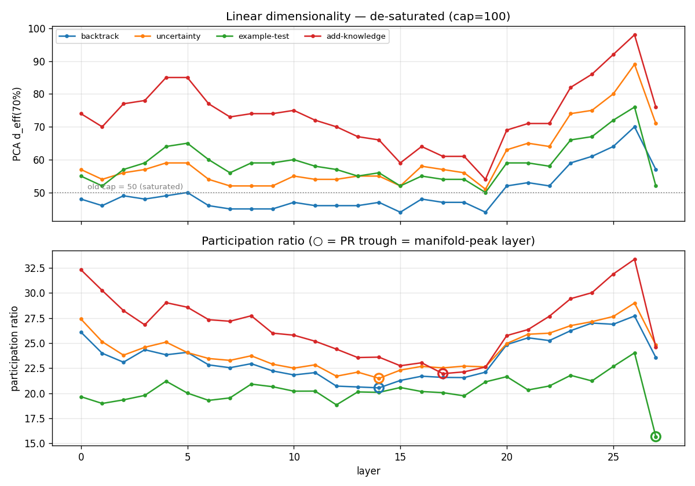
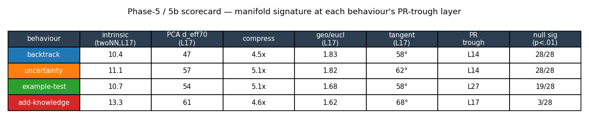
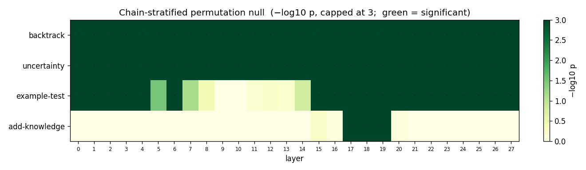
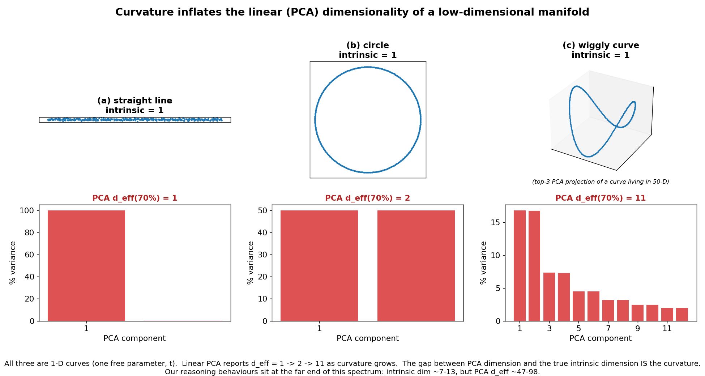
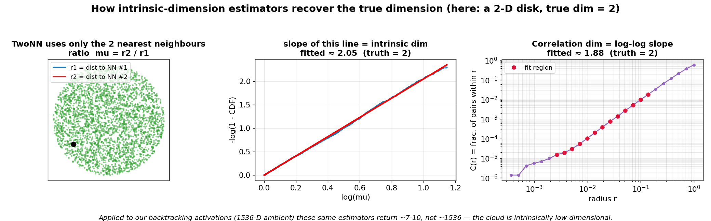
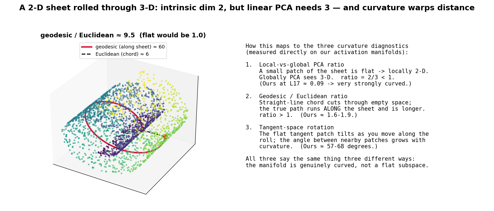

# Reasoning on a Manifold — Project Log & Synthesis

*Single consolidated record of the project: what we asked, what we did, what we found, how it confirms the hypothesis, and what comes next. Supersedes the separate SUMMARY / CHECKPOINT / DEEP_DIVE notes (kept for reference).*

**Last updated:** 28 May 2026 · **Model under test:** DeepSeek-R1-Distill-Qwen-1.5B (28 layers, hidden dim 1536) · **Scale extension in progress:** R1-Distill-Qwen-7B.

---

## 0. TL;DR

> Individual reasoning behaviours in a distilled reasoning model each occupy a **curved, low-dimensional manifold** in the residual stream — not a single linear direction (Venhoff), and not an undifferentiated aggregate (Huang). Across all four target behaviours the true intrinsic dimension is **~7–13**, while linear PCA needs **~47–98** axes to describe the same cloud; the gap is curvature, confirmed by three independent diagnostics. A chain-stratified permutation null run at **every one of the 28 layers** rules out the obvious confound — decisively for two behaviours (significant at all 28 layers), strongly for a third (19/28), and locally for the fourth (L17–19). The geometry peaks at middle layers (L14–17) even though the behaviours are linearly decodable everywhere. Steering vectors are built and staged; the only blockers to the interventional half are API credits and a free GPU.

---

## 1. The question and the wedge

Two recent papers bracket the question:

- **Venhoff et al. (2506.18167):** each individual reasoning behaviour (backtracking, uncertainty-estimation, example-testing, knowledge-augmentation) is captured by a **single linear direction** — effective dimension 1 per behaviour.
- **Huang et al.:** the *aggregate* "overthinking" phenomenon lives on a **manifold**, but they never separate it into individual behaviours.

**Our wedge:** test whether *individual* behaviours each have their own *multi-dimensional, curved* manifold — i.e. Huang's geometric framing applied at Venhoff's behavioural granularity.

**Falsifiable claim.** If, across behaviours, (i) PCA d_eff ≫ 1, (ii) the intrinsic dimension is far below that ambient PCA dimension (curvature), and (iii) a chain-stratified null rejects, then the single-direction view is insufficient and the manifold framing is warranted.

---

## 2. Project log — what we've done

| Phase | Description | Status |
|---|---|---|
| 1 | Task generation (1,000 tasks × 10 reasoning categories) | ✅ |
| 2 | Chain generation (R1-Distill-1.5B, greedy, ≤8192 tok) | ✅ 1,000 chains |
| 3 | Annotation (Sonnet 4.5, 6-label Venhoff taxonomy) | ✅ 993/1000 (77,183 spans) |
| 4 | Activation extraction (per-sentence, mean-pooled, 28 layers) | ✅ 37,851 vectors |
| 5 | PCA dimensionality across all 28 layers + per-layer null | ✅ (fresh, corrected) |
| 5b | Geometric deep-dive (intrinsic dim, curvature, nulls) | ✅ (fresh, B=300) |
| 5c | Cross-layer linear probing | ✅ |
| 5d | Sub-type clustering | ✅ |
| triangulation | Multi-criteria layer selection (PR / probe / patching) | ✅ |
| 6 | Steering-vector construction (single + manifold) | ✅ **this session** |
| 7 | Steering evaluation (behavioural validation) | ⏳ blocked: API credits + GPU |
| baseline | Qwen-Math-1.5B control corpus | ✅ generated; annotation ⏳ credits |
| 7B | Cross-scale replication (500 balanced chains) | 🔄 generating (~weeks) |

**Method corrections made this session** (the previous run had a saturated-dimensionality bug):
1. PCA component cap 50 → 100, so d_eff_70 / PR stop saturating at 50.
2. Layer selection now uses **participation-ratio argmin** (geometric peak), not d_eff argmax (which was unreliable once saturated).
3. Sub-type clustering focus layer fixed (was a layer-0 artifact).
4. Fixed a missing `numpy` import that crashed the null path; added boundary-aware curve smoothing and a missing-import-safe master pipeline.
5. Old results archived; the entire geometry pipeline re-run clean and uncontaminated (~56 min, all phases exit 0).

---

## 3. The data

| Item | Count | Notes |
|---|---|---|
| R1 chains (1.5B) | 1,000 | 10 categories × 100; mean 5,052 tokens |
| Annotated chains | 993 | 7 chronic 503-failures excluded |
| Sentence spans | 77,183 | mean 77.7 / chain |
| Activation vectors | 37,851 × 28 layers | per behaviour N = 10,267 / 16,728 / 5,829 / 5,027 |
| Baseline (Qwen-Math-1.5B) | 1,000 | control; annotation pending credits |

Annotation distribution vs Venhoff: we see ~2.4× more uncertainty-estimation and ~3.3× more backtracking — expected, since our tasks are harder/more diverse than Venhoff's math benchmarks. Does not affect the manifold claim.

---

## 4. Result I — dimensionality across layers (Phase 5)



We track two metrics across all 28 layers. They weight the PCA spectrum differently and the gap between them is informative:

- **PCA d_eff(70%)** — components needed for 70% of variance. *Tail-sensitive.*
- **Participation ratio** PR = (Σλ)² / Σλ² — number of *dominant* directions. *Head-dominated, sample-size robust.*

**PCA d_eff(70%) — true (de-saturated) values:**

| Behaviour | L0 | L7 | L14 | L17 | L21 | L26 | L27 |
|---|---|---|---|---|---|---|---|
| backtracking | 48 | 45 | 47 | 47 | 53 | **70** | 57 |
| uncertainty-estimation | 57 | 52 | 55 | 57 | 65 | **89** | 71 |
| example-testing | 55 | 56 | 56 | 54 | 59 | **76** | 52 |
| adding-knowledge | 74 | 73 | 66 | 61 | 71 | **98** | 76 |

**Participation ratio (lower = more concentrated):**

| Behaviour | L0 | L7 | L14 | L17 | L21 | L26 | L27 |
|---|---|---|---|---|---|---|---|
| backtracking | 26.1 | 22.5 | **20.5** | 21.6 | 25.5 | 27.7 | 23.6 |
| uncertainty-estimation | 27.4 | 23.3 | **21.5** | 22.5 | 25.9 | 29.0 | 24.8 |
| example-testing | 19.7 | 19.5 | 20.1 | 20.1 | 20.3 | 24.0 | **15.7** |
| adding-knowledge | 32.3 | 27.2 | 23.6 | **22.0** | 26.4 | 33.4 | 24.6 |

**How to read the two curves:**
- **d_eff is high everywhere (45–98) and peaks late (L26).** Venhoff's d_eff = 1 is decisively falsified at every layer. The late-layer climb means the variance spectrum grows a *heavy tail*.
- **PR troughs at the middle layers** — L14 (backtracking, uncertainty), L17 (adding-knowledge), L27 (example-testing). The trough marks where the representation is most **concentrated** into a few dominant directions: the *manifold-peak layer*.
- **They diverge by design.** At L14 a few directions dominate (low PR) yet you still need ~47 axes for 70% (moderate d_eff): a sharp head + a long tail — exactly the linear-PCA fingerprint of a **curved low-dimensional** manifold. The behaviour-specific abstraction concentrates at middle layers (matching where Venhoff's attribution patching peaks — geometry and causality coincide), then re-expands toward the output at late layers.

---

## 5. Result II — the manifold signature (Phase 5b)

Three independent batteries answer three questions: *is it low-dimensional, is it curved, is it real?*



| Behaviour | Intrinsic (twoNN, L17) | PCA d_eff70 (L17) | Compression | Geo/Eucl | Tangent | PR trough | Null sig (p<.01) |
|---|---|---|---|---|---|---|---|
| backtracking | 10.4 | 47 | 4.5× | 1.83 | 58° | L14 | **28/28** |
| uncertainty-estimation | 11.1 | 57 | 5.1× | 1.82 | 62° | L14 | **28/28** |
| example-testing | 10.7 | 54 | 5.1× | 1.68 | 58° | L27 | 19/28 |
| adding-knowledge | 13.3 | 61 | 4.6× | 1.62 | 68° | L17 | 3/28 (L17–19) |

### 5.1 Low-dimensional?  (intrinsic dim ≪ PCA dim)
Three estimators (TwoNN, Levina-Bickel, correlation dim) all land in **6–13** and agree within ~2× — meaning the dimension is well-defined (a real manifold, not noise, not a flat 50-D blob). The intrinsic dim sits **~5× below** the ambient PCA dimension. *That gap is the entire result.*

### 5.2 Even stronger at each behaviour's own peak layer
The L17 reference understates it. At each behaviour's **PR-trough** layer the compression intensifies:

| Behaviour | Peak | twoNN | d_eff70 | Compression |
|---|---|---|---|---|
| backtracking | L14 | 7.2 | 47 | **6.6×** |
| uncertainty-estimation | L14 | 6.4 | 55 | **8.6×** |
| example-testing | L27 | 7.4 | 52 | **7.0×** |
| adding-knowledge | L17 | 13.3 | 61 | **4.6×** |

For the three strong behaviours intrinsic dim falls to **6–7** at the peak (a 6.6–8.6× compression). The gap *widens toward late layers* (d_eff → 98 at L26 while intrinsic stays ~10–13) — **curvature increases with depth**.

### 5.3 Curved?  (three diagnostics agree)
- **Local-vs-global PCA ratio ≈ 0.09** — a small patch looks ~9% of the global dimension (flat would be 1.0).
- **Geodesic / Euclidean ≈ 1.6–1.9** — the path along the manifold is 60–90% longer than the straight chord (flat = 1.0).
- **Tangent rotation ≈ 57–68°** — the tangent plane turns sharply between nearby points (flat = 0°).

Three formalisms, one conclusion: strongly curved, not a flat subspace.

### 5.4 Real?  (chain-stratified null, all 28 layers)



The confound: two sentences from the same chain may look alike *because of the chain*, not the label. The chain-stratified null shuffles labels **within each chain** and recomputes; beating that null means the structure is behaviour-specific.

- backtracking, uncertainty: **significant at all 28/28 layers**.
- example-testing: **19/28** (early L0–6 + late L15–27; gap L7–14).
- adding-knowledge: **L17–19 only** — real but tightly localised.

Bonferroni across 4 × 28 = 112 tests (α ≈ 0.00045) is cleared by the two strong behaviours at every layer.

---

## 6. Understanding intrinsic dimensionality (explainer + visuals)

### 6.1 Why a "high" d_eff is *not* a contradiction



All three shapes above are **1-D curves** (one free parameter). Linear PCA reports d_eff = 1 → 2 → 11 as curvature grows. *The gap between PCA dimension and the true intrinsic dimension IS the curvature.* Our reasoning behaviours are the far end of this spectrum: intrinsic ~7–13, PCA d_eff ~47–98.

### 6.2 The estimators

All exploit one fact: on a *d*-dimensional manifold, a small ball of radius *r* contains a point-count that grows like *rᵈ*. Measure that scaling and you recover *d*, regardless of curvature or ambient dimension.

```
TwoNN (Facco 2017) — 2-point, most local, most robust
   mu = r2/r1  (ratio of 2nd to 1st NN distance) depends only on local dim;
   density cancels. mu ~ Pareto(d):  -log(1 - F(mu)) = d * log(mu)  -> slope = d.
   Weakness: mild over-estimate near boundaries.   Ours ~ 7-10.

Levina-Bickel (2004) — MLE over k neighbours, lower variance
   d_hat = [ (1/(k-1)) * sum_j log( T_k / T_j ) ]^(-1),  T_j = dist to j-th NN.
   Weakness: larger neighbourhood lets curvature in -> reads slightly high (~13-15).

Correlation dimension (Grassberger-Procaccia 1983) — global, very stable
   C(r) = (1/N^2) * #{ pairs within r }  ~  r^d  ->  slope of log C(r) vs log r.
   Weakness: biased LOW for curved manifolds (curve folds back) -> ours ~ 7.
```

**Reading them together:** agreement within ~2× ⇒ the dimension is well-defined. The *ordering* correlation-dim < TwoNN < Levina-Bickel is itself the signature of mild curvature — and it is exactly our pattern.



*Sanity check on a known 2-D disk: TwoNN recovers 2.05, correlation-dim 1.88. On our 1536-D activations the same machinery returns ~7–13, not ~1536.*

### 6.3 Curvature warps distance — and how we measure it



A 2-D sheet rolled through 3-D: intrinsic dim 2, ambient 3. Two points that are close in 3-D (chord ≈ 6) are far along the sheet (geodesic ≈ 60). This single picture motivates all three curvature diagnostics we apply to the real manifolds (local-vs-global, geodesic/Euclidean, tangent rotation).

---

## 7. Result III — supporting analyses (5c, 5d)

**5c — cross-layer probing.** Every behaviour is linearly decodable **85–92% at *all* layers** (peaks: add-knowledge 91.9% @L11, example-test 90.5% @L11, uncertainty 87.5% @L13, backtrack 86.2% @L11), and the probe curve is **flat**. So *linear decodability ≠ manifold geometry*: a behaviour can be read off a single hyperplane everywhere, yet its geometric concentration still localises to the middle layers. This is a clean, citable distinction.

**5d — sub-type clustering.** At each behaviour's PR-trough layer, k-means + silhouette selects **k = 2 for all four behaviours, with weak silhouettes (0.11–0.18)** — i.e. *no clean discrete sub-types*. The behaviours are better described as **continuous curved manifolds** than as mixtures of discrete clusters. The earlier hypothesis that adding-knowledge splits into 4–6 sub-types is **not supported**. (Consequence: the Phase-7 "sub-type steering" study is reframed as *continuous-manifold steering*.)

---

## 8. Result IV — steering vectors built (Phase 6, this session)

For each behaviour we built, at its **manifold-peak layer**, two vectors: the **single-direction** (Venhoff difference-of-means) and the **manifold-projected** (ours: that direction projected onto the top-k PCA subspace of the behaviour's own activations, `r_proj = Σᵢ (r·vᵢ) vᵢ`).

A free, immediate result is *how much of the single-direction vector already lives inside the behaviour's manifold* (cosine between the two = fraction of the direction's energy captured by the top-`auto_k` PCs):

| Behaviour | Layer | auto_k | cos(single, manifold) | energy in manifold | cos at k=1 |
|---|---|---|---|---|---|
| backtracking | L14 | 47 | 0.959 | 91.9% | 0.615 |
| uncertainty-estimation | L14 | 55 | 0.970 | 94.1% | 0.396 |
| example-testing | L27 | 52 | 0.936 | 87.6% | **0.005** |
| adding-knowledge | L17 | 61 | 0.963 | 92.8% | **0.098** |

**Interpretation.** The difference-of-means steering direction lies **~88–94%** inside each behaviour's own manifold subspace — but it is **nearly orthogonal to the single top principal component** for example-testing (0.005) and adding-knowledge (0.098), and only partially aligned for the others. So the behaviour-defining direction is a **distributed, mid-spectrum feature of the manifold, not the dominant variance axis.** This is independent corroboration of the manifold picture, and it predicts that the manifold-vs-single comparison in Phase 7 will be most informative at *intermediate* k (where projection meaningfully redirects the vector). Vectors are saved at `results/steering_vectors/R1-1.5B/` and load-verified for Phase 7.

---

## 9. How this confirms the hypothesis

We pre-registered three possible "stories":

| Story | Intrinsic dim | Curvature | Null | Verdict |
|---|---|---|---|---|
| A — curved low-dim manifold | low (≪ ambient) | curved | rejects | **our result** |
| B — flat high-dim subspace | ≈ ambient (~50) | flat (ratios = 1) | rejects | not us |
| C — chain confound (negative) | high | high | **fails** | not us |

We land squarely in **Story A**: d_eff ≫ 1 (Venhoff falsified) **and** intrinsic ≪ d_eff (curved, not flat high-D) **and** three curvature diagnostics agree **and** the null rejects. Per behaviour:

- **backtracking & uncertainty** — flagship cases: significant at every layer, intrinsic 6–7 at the peak, strong curvature, peak at the causal middle layers.
- **example-testing** — clearly a manifold, but with an early-and-late profile (peak L27, null gap L7–14).
- **adding-knowledge** — the honest outlier: highest intrinsic (13.3), null only at L17–19, no sub-types. Real but diffuse and localised.

The wedge between Venhoff and Huang is **empirically supported for individual reasoning behaviours.**

---

## 10. Comparison with prior work

| Study | Concept type | Intrinsic dim | Statistical control |
|---|---|---|---|
| Goodfire 2026 (manifold steering) | Cyclic concepts (days, months) | 1 (1-D circle) | None — visualisation only |
| Engels et al. 2024 | Generic features | 2–6 | None |
| Venhoff et al. 2025 | Reasoning behaviours | 1 (assumed) | Bootstrap CIs only |
| **Us 2026** | **Reasoning behaviours** | **7–13** | **Chain-stratified null at every layer** |

We *extend* the literature: the same manifold signature (intrinsic ≪ ambient + curvature) but at higher dimensionality in non-parametric reasoning behaviours, plus a methodological contribution — the per-layer chain-stratified null and multi-estimator intrinsic-dim triangulation that the prior descriptive/visual work lacks.

---

## 11. What we expect, and what's next

**Phase 7 — steering evaluation (the interventional half).** Apply the single vs manifold vectors during generation across α values and measure the behaviour-fraction shift in re-annotated outputs. Prediction (sharpened by §8): manifold projection helps most at intermediate k, and least where the difference-of-means already fills the subspace. **Blocked on:** (a) API credits for re-annotation, (b) a free GPU — currently committed to the 7B run for ~2–3 weeks.

**7B cross-scale replication.** Phase 4/5/5b on the 7B chains need *no API* (GPU for extraction, CPU after). Proceeds automatically as chains land. Generation is slow (~weeks at 8192 tokens) — kept at full scale by choice.

**The credit ask (~$290, annotation only):** baseline annotation ($50), Phase-7 main re-annotation ($120), layer-comparison case study ($30), continuous-manifold steering study ($40), self-consistency ($10), buffer ($40). Fallbacks: $220 minimum (defensible paper), $250, $290 (full).

**Creditless work available now:** ✅ Phase 6 (done), secondary null variants (cross-chain, Marchenko-Pastur), the 5c subspace-angle results, trajectory analysis, and drafting the geometry half of the paper (final & verified).

---

## 12. Risks & open questions

1. **d_eff is high (45–98), not low** — *not* a problem: intrinsic dim (5b) is ~5× lower and the gap widens with depth, the hallmark of curvature. But "manifold" here means ~10-D and curved, not a 1–2-D circle (cf. Goodfire).
2. **adding-knowledge is weak** — null only L17–19; reported honestly.
3. **No discrete sub-types** (5d k=2, weak silhouette) — reframes the sub-type steering study as continuous-manifold steering.
4. **7B is slow** (~weeks); revisit scope if needed.
5. **Phase 7 double-gated** on credits *and* GPU availability.

---

## 13. Reproducibility / file map

```
data/
  chains_R1-1.5B annotated (data/annotated_R1-1.5B.json)   77,183 spans
  activations/R1-1.5B/   {behaviour}_layer{0..27}.npy       37,851 vectors
results/
  pca/R1-1.5B/           layer_profiles.json, null_pvalues_per_layer.json, summary_layer*.json
  geometric/R1-1.5B/     diagnostics_layer{11,14,17,20,27}.json   (5b)
  cross_layer/R1-1.5B/   probe_accuracy.json                      (5c)
  clustering/R1-1.5B/    {behaviour}_layer{L}/summary.json         (5d)
  triangulation/R1-1.5B/ candidate_layers.json, summary.md
  steering_vectors/R1-1.5B/  {behaviour}_{single,manifold_k*}.npy, metadata.json, phase6_comparison.json
  _archive_run1_*/       the previous (saturated) run, archived for provenance
  supervisor_meeting/    figures + this log
pipeline:  05_pca_analysis.py --with-nulls  ->  05c  ->  compute_layer_triangulation.py  ->  05d  ->  05b
           ->  build_phase6.py   (run_rerun_local.sh drives 5/5c/triangulation/5d/5b)
figures:   make_fresh_figures.py (fig1/8/9),  make_explainer_figs.py (viz1/2/3),  render_html.py (-> .html)
```

*Geometry half: complete, verified, reproducible. Interventional half: staged, awaiting credits + GPU.*
