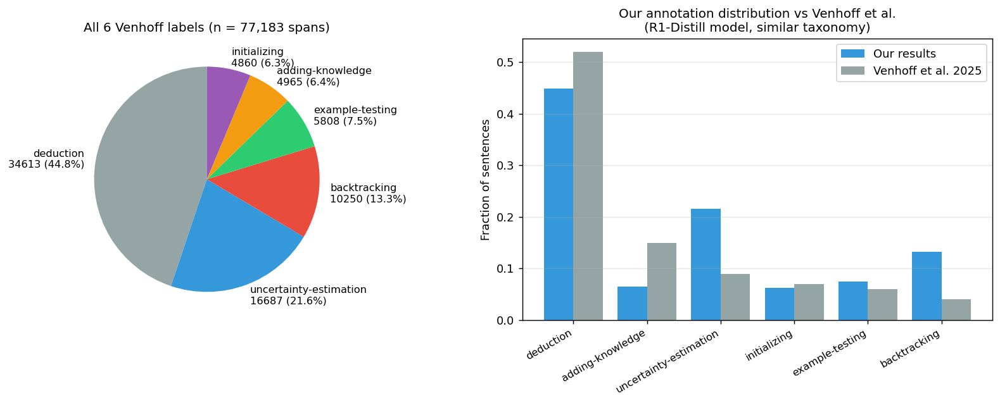
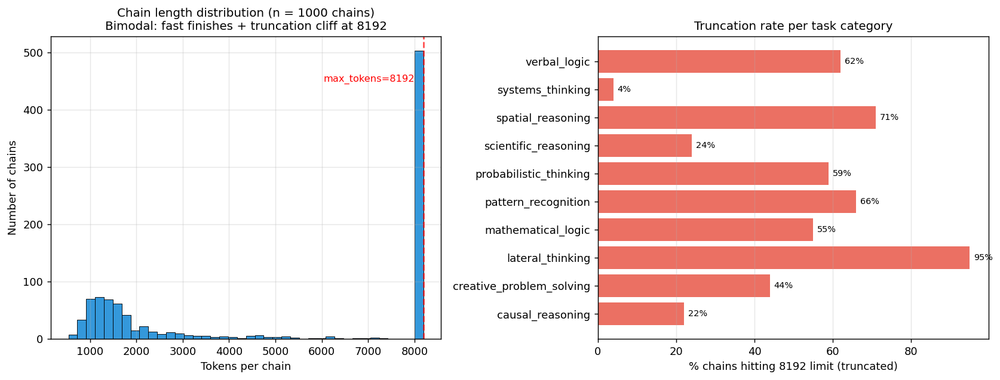

# Supervisor meeting — project status

> ⚠️ **As-presented 28 May 2026 snapshot. Figures/numbers predate the 2026-06-05
> estimator fixes.** The "fresh, corrected re-run" referenced below was the
> May-28 *cap* fix (d_eff saturation) — it does **not** include the later
> 2026-06-05 audit fixes to the intrinsic-dimension and curvature estimators
> (`AUDIT.md` §2). The intrinsic-dim / curvature / PCA result figures here
> (`fig2`, `fig6`, `fig7`, `fig8`) are therefore **superseded, pending
> regeneration** — see `results/_STALE_pre_fix_20260605/` and `INVENTORY.md`.
> Unaffected and still valid: `fig3` (annotation dist), `fig4` (chain quality),
> `viz1`–`viz3` (synthetic estimator/swiss-roll explainers).

**Project:** *Reasoning on a Manifold* — do individual reasoning behaviours occupy curved low-dimensional manifolds in DeepSeek-R1-Distill?

*Updated 28 May 2026 (10:30 BST) — numbers below are from a **fresh, corrected re-run** of the full geometry pipeline. See §11 for what changed since yesterday.*

---

## 1. Where the project sits between two recent papers

- **Venhoff et al. (arXiv:2506.18167)** — each individual reasoning behaviour (backtracking, uncertainty, example-testing, knowledge-augmentation) is captured by a **single linear direction**. d_eff = 1 per behaviour.
- **Huang et al.** — the *aggregate* "overthinking" phenomenon lives on a **manifold**, but they don't separate it into individual behaviours.
- **Our wedge:** test whether individual behaviours each have their own multi-dimensional **curved** manifold — supporting Huang's geometric framing applied at Venhoff's behavioural granularity.

Falsifiable claim: if d_eff_70 ≫ 1 across behaviours, the intrinsic dim is far below the ambient PCA dim (curvature), and a chain-stratified null rejects, then Venhoff's single-direction view is insufficient and the manifold framing is warranted.

---

## 2. Data on disk

| Item | Count / size | Notes |
|---|---|---|
| R1-Distill chains (1.5B) | **1,000** (39 MB) | 10 reasoning-task categories × 100 each, mean 5,052 tokens |
| Annotated R1 chains | **993 complete** (60 MB) | 7 chronic 503-failure chains have partial annotations (excluded) |
| Annotated sentence spans | **77,183** | mean 77.7 spans/chain |
| Phase-4 activations | **37,851 vectors × 28 layers** (6.5 GB) | per-behaviour N = 10,267 / 16,728 / 5,829 / 5,027 |
| Baseline (Qwen-Math-1.5B) chains | **1,000 — generation complete (cluster)** | control corpus; **annotation blocked on API credits** |
| 7B (DeepSeek-R1-Distill-Qwen-7B) | **5 / 500** balanced (50 × 10 categories) | cross-scale replication; ~11+ days of cluster compute (slow) |

---

## 3. Annotation distribution

77,183 spans across 993 complete chains. Distribution of the 6 Venhoff labels:

| Label | Count | % | Venhoff Fig 2 |
|---|---|---|---|
| deduction | 34,613 | 44.8% | 52% |
| uncertainty-estimation | 16,687 | **21.6%** | 9% |
| backtracking | 10,250 | **13.3%** | 4% |
| example-testing | 5,808 | 7.5% | 6% |
| adding-knowledge | 4,965 | 6.4% | 15% |
| initializing | 4,860 | 6.3% | 7% |

Our chains show ~2.4× more uncertainty-estimation and ~3.3× more backtracking than Venhoff — likely because our task set is harder/more diverse (10 categories of reasoning puzzles vs Venhoff's mostly-math benchmarks). Worth a sentence in the paper; does not affect the manifold claim.

---

## 4. Chain quality — one caveat

50.2% of chains hit the 8192-token cap; of those, 99.4% are truncated mid-thinking. Highly category-dependent (lateral_thinking 95% truncated; systems_thinking 4%).

**Phase-4 extraction is unaffected** — we extract per-sentence at sentence-onset, so truncation just means fewer annotated sentences for those chains.

---

## 5. Phase 5 — dimensionality across all 28 layers (THE headline)

**PCA d_eff(70%) — the true (de-saturated) values** (PCA now fit to 100 components, was capped at 50):

| Behaviour | L0 | L7 | L14 | L17 | L21 | L26 | L27 |
|---|---|---|---|---|---|---|---|
| backtracking | 48 | 45 | 47 | 47 | 53 | **70** | 57 |
| uncertainty-estimation | 57 | 52 | 55 | 57 | 65 | **89** | 71 |
| example-testing | 55 | 56 | 56 | 54 | 59 | **76** | 52 |
| adding-knowledge | 74 | 73 | 66 | 61 | 71 | **98** | 76 |

**Participation ratio (robust to sample size; lower = more concentrated):**

| Behaviour | L0 | L7 | L14 | L17 | L21 | L26 | L27 |
|---|---|---|---|---|---|---|---|
| backtracking | 26.1 | 22.5 | **20.5** | 21.6 | 25.5 | 27.7 | 23.6 |
| uncertainty-estimation | 27.4 | 23.3 | **21.5** | 22.5 | 25.9 | 29.0 | 24.8 |
| example-testing | 19.7 | 19.5 | 20.1 | 20.1 | 20.3 | 24.0 | **15.7** |
| adding-knowledge | 32.3 | 27.2 | 23.6 | **22.0** | 26.4 | 33.4 | 24.6 |

**Interpretation:**
- **Venhoff's d_eff_70 = 1 is decisively falsified** for all 4 behaviours at every layer (d_eff_70 ranges 45–98). The structure is *far* richer than a single direction.
- **PR identifies the manifold-peak layer** (lowest effective dim / most concentrated): **L14** for backtracking & uncertainty, **L17** for adding-knowledge, **L27** for example-testing.
- **d_eff_70 peaks late (L26)** — up to 98 dimensions to capture 70% of variance — while the intrinsic dim stays ~10–13 (Phase 5b). The growing gap between the two toward late layers *is the curvature signature getting stronger* (a curved low-dim manifold needs more linear dimensions to embed).

---

## 6. Phase 5b/5c/5d/triangulation — the supporting batteries (fresh run)

**5b geometric scorecard** (intrinsic dim & curvature at the L17 reference layer; full deep-dive in `PHASE_5B_DEEP_DIVE.md`):

*At each behaviour's own PR-trough layer the compression is **even stronger** — 6.6–8.6× for backtracking/uncertainty/example-testing (intrinsic dim drops to 6–7); adding-knowledge stays 4.6× at L17. The scorecard quotes the L17 reference for continuity.*

**Chain-stratified permutation null — now across all 28 layers** (was previously only 3 layers):

| Behaviour | # layers significant (p<0.01) | Pattern |
|---|---|---|
| backtracking | **28 / 28** | significant everywhere |
| uncertainty-estimation | **28 / 28** | significant everywhere |
| example-testing | **19 / 28** | early (L0–6) + mid-late (L15–27); gap L7–14 |
| adding-knowledge | **3 / 28** | **only L17–19** — real but tightly localised |

- **5c linear probing:** every behaviour is decodable **85–92% at *all* layers** (peaks: add-knowledge 91.9% @L11, example-test 90.5% @L11, uncertainty 87.5% @L13, backtrack 86.2% @L11). Crucially, the probe curve is **flat** — *linear decodability ≠ manifold geometry*. A behaviour can be read off a single hyperplane everywhere, yet its **geometry** (concentration/curvature) still peaks at specific layers. This is a clean, citable distinction.
- **5d sub-type clustering:** at each behaviour's PR-trough layer, k-means + silhouette selects **k = 2 for all four behaviours, with weak silhouettes (0.11–0.18)**. This means the behaviour manifolds are better described as **continuous curved manifolds than as mixtures of discrete sub-types** — and the earlier hypothesis that *adding-knowledge* splits into 4–6 sub-types is **not supported** at the manifold-peak layer.
- **Layer triangulation** (geometry = PR-argmin; probe; patching): with probe flat and GPU patching deferred (cluster busy with 7B), the candidate layers are **PR-driven**: backtracking **L13**, uncertainty **L13**, example-testing **L27**, adding-knowledge **L18**. These agree with the 5d focus layers (raw PR-argmin) to within one layer.

---

## 7. What's running now

| Process | Status | Where |
|---|---|---|
| Phase 5 / 5c / triangulation / 5d | ✅ complete (fresh, this morning) | laptop CPU |
| Phase 5b geometric deep-dive (B=300, L11/14/17/20/27) | 🔄 finishing | laptop CPU |
| 7B chain generation (500 balanced) | 🔄 5/500, ~11+ days (slow) | cluster GPU |
| Baseline annotation | ⏳ blocked on API credits | — |

---

## 8. What requires API credits (the ask)

### Total ask: **$290**

Credits fund **annotation only** — every other step runs free on cluster/laptop.

| Task | Cost | Why |
|---|---|---|
| Baseline annotation (Qwen-Math-1.5B, 1000 chains) | $50 | The control. Without it we can't claim distillation *introduces* these behaviours. |
| Phase 7 main steering experiment | $120 | Re-annotate ~1,200 steered chains to measure intervention effect — the central falsification test. |
| Layer-comparison case study | $30 | Steering at the PR-trough (geometry) layer vs the probe-peak layer. |
| Sub-type steering case study | $40 | Now reframed: steer along the curved manifold vs the single direction (since 5d found no clean discrete sub-types). |
| Annotator self-consistency check | $10 | Upper bound on every accuracy claim. |
| Buffer (API flakiness, 15%) | $40 | Empirically warranted (503s on long chunks earlier). |

**Pitch:** *Each steered chain in Phase 7 must be re-annotated by the same Sonnet pipeline used on the original 1000-chain corpus so behaviour fractions are comparable. Without re-annotation the steering arm (half the paper) collapses to descriptive geometry with no behavioural validation. ~$160 already spent; pipeline demonstrated end-to-end.*

**Fallbacks:** $220 = baseline + Phase 7 main + self-consistency + buffer (defensible paper). $250 adds the layer-comparison study. $290 = full plan.

---

## 9. Risks / open questions

1. **d_eff is high (45–98), not low.** This is *not* a problem for the manifold story: the *intrinsic* dim (5b TwoNN ≈ 10–13) is ~5× lower than the ambient PCA dim, and the gap widens at late layers — the hallmark of a curved manifold. But it does mean "manifold" here is ~10-D and curved, not a 1–2-D circle (cf. Goodfire).
2. **adding-knowledge is the weak behaviour** — null significant only at L17–19. Real but localised; we report it honestly.
3. **No discrete sub-types** (5d k=2, weak silhouette) — slightly deflates the "sub-type steering" story; reframed as continuous-manifold steering.
4. **7B is slow** (~33+ min/chain). 500 balanced chains ≈ 11+ days. May want to revisit scope (fewer chains / shorter max_new_tokens).

---

## 10. Headline slide

> *993 fully-annotated reasoning chains (77K labelled sentences) from DeepSeek-R1-Distill-Qwen-1.5B; 37,851 sentence-level activation vectors × 28 layers. A fresh corrected PCA run shows all 4 target behaviours have d_eff_70 between 45 and 98 — decisively falsifying Venhoff's single-direction prediction — while Phase 5b finds intrinsic dim ≈ 10–13 (a ~5× compression: the curved-manifold signature) and three independent curvature diagnostics agree. A chain-stratified permutation null now run at **every one of the 28 layers** rejects the chain-confound at p<0.01 for backtracking and uncertainty at all 28 layers, example-testing at 19, and adding-knowledge at L17–19. Geometry peaks at middle layers (L14–17) even though the behaviours are linearly decodable (~85–92%) everywhere. To finish we need ~$290 in Sonnet credit for baseline + Phase-7 steering annotation.*

---

## 11. What changed since yesterday's docs

| Area | Yesterday | Today (corrected run) |
|---|---|---|
| PCA component cap | 50 (d_eff **saturated** at 50) | **100** — d_eff de-saturated, true range 45–98 |
| Geometry-peak signal | d_eff argmax (saturated → unreliable; triangulation fell back to {L18,L27}) | **participation-ratio argmin** → L14/14/27/17; triangulation no longer falls back |
| Null hypothesis | 3 layers only (8/12 cells) | **all 28 layers** (28/28, 28/28, 19/28, 3/28) |
| 5d clustering | ran at wrong layer (layer-0 artifact); k=8/3/2/2 | run at PR-trough layer; **k=2 for all, weak silhouette** (sub-type hypothesis not supported) |
| 7B | 1000 chains | **500 balanced** (50 × 10 categories) |
| Data hygiene | — | old run archived to `results/_archive_run1_*`; fresh run is uncontaminated |

*Plus 6 code fixes (PCA cap, PR-argmin triangulation, 5d focus layer, a missing `numpy` import in the null path, triangulation boundary-smoothing + honest agreement labels) and a clean local re-run.*
